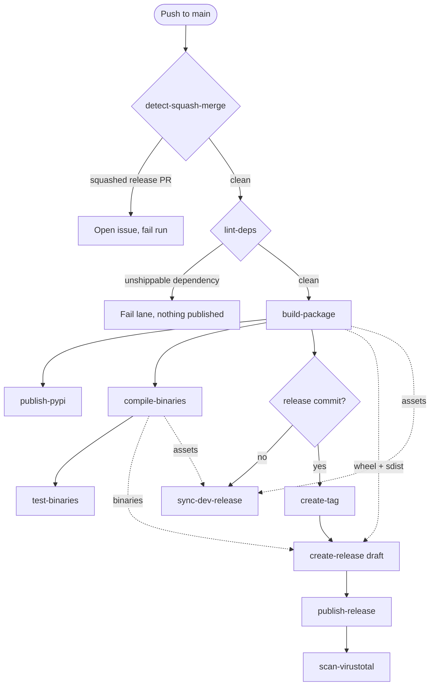
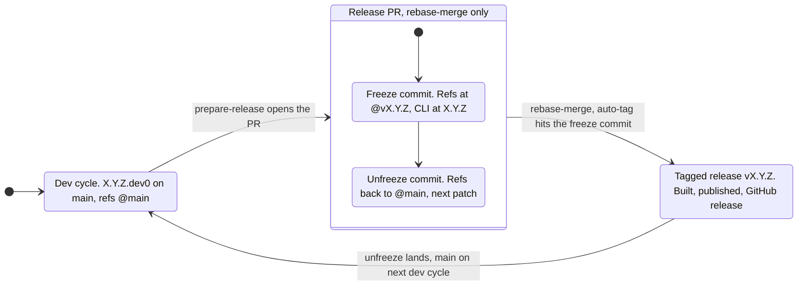

# {octicon}`workflow` Reusable workflows

The `repomatic` CLI is invoked in CI from [reusable GitHub Actions workflows](https://docs.github.com/en/actions/how-tos/reuse-automations/reuse-workflows). You configure behavior via [`[tool.repomatic]`](configuration.md) in `pyproject.toml`; the workflows trigger jobs and wire their outputs together, the CLI does the work.

### Example usage

The fastest way to adopt these workflows is with `repomatic init` (see [Quick start](install.md#quick-start)). It generates all the thin-caller workflow files for you.

If you prefer to set up a single workflow manually, create a `.github/workflows/lint.yaml` file [using the `uses` syntax](https://docs.github.com/en/actions/how-tos/reuse-automations/reuse-workflows#calling-a-reusable-workflow):

```yaml
name: Lint
on:
  push:
  pull_request:

jobs:
  lint:
    uses: kdeldycke/repomatic/.github/workflows/lint.yaml@v7.14.0
```

> [!IMPORTANT]
> [Concurrency is already configured](security.md#concurrency-and-cancellation) in the reusable workflows: you don't need to re-specify it in your calling workflow.

### GitHub Actions limitations

GitHub Actions has several design limitations that the workflows work around:

| Limitation                                                                                                                                                                       | Status             | Addressed by                                                                                                                                                                                                                            |
| :------------------------------------------------------------------------------------------------------------------------------------------------------------------------------- | :----------------- | :-------------------------------------------------------------------------------------------------------------------------------------------------------------------------------------------------------------------------------------- |
| [No conditional step groups](https://github.com/orgs/community/discussions/43467)                                                                                                | ✅ Addressed       | [`metadata` job](#what-is-this-metadata-job) + [`repomatic show-metadata`](cli.md)                                                                                                                                                      |
| [Workflow inputs only accept strings](https://github.com/actions/runner/issues/1483)                                                                                             | ✅ Addressed       | String parsing in [`repomatic`](cli.md)                                                                                                                                                                                                 |
| [Matrix outputs not cumulative](https://github.com/actions/runner/issues/1835)                                                                                                   | ✅ Addressed       | [`metadata`](#what-is-this-metadata-job) pre-computes matrices                                                                                                                                                                          |
| [Static matrix can't express conditional dimensions](https://github.com/orgs/community/discussions/9044) or [array excludes](https://github.com/orgs/community/discussions/7835) | ✅ Addressed       | [Dynamic test matrices](#dynamic-test-matrices) via [`[tool.repomatic.test-matrix]`](configuration.md)                                                                                                                                  |
| [`cancel-in-progress` evaluated on new run, not old](https://github.com/orgs/community/discussions/69704)                                                                        | ✅ Addressed       | [SHA-based concurrency groups](security.md#concurrency-and-cancellation) in [`release.yaml`](#github-workflows-release-yaml-jobs)                                                                                                       |
| [Cross-event concurrency cancellation](https://docs.github.com/en/actions/writing-workflows/choosing-what-your-workflow-does/control-the-concurrency-of-workflows-and-jobs)      | ✅ Addressed       | [`event_name` in `changelog.yaml` concurrency group](security.md#concurrency-and-cancellation)                                                                                                                                          |
| [PR close doesn't cancel runs](https://github.com/orgs/community/discussions/25432)                                                                                              | ✅ Addressed       | [`cancel-runs.yaml`](#github-workflows-cancel-runs-yaml-jobs)                                                                                                                                                                           |
| [`pull_request.branches-ignore` filters base branch, not head](https://github.com/actions/runner/issues/1591)                                                                    | ✅ Addressed       | `github.head_ref` check in `metadata` job's `if:`, propagated via `needs:`. See [`tests.yaml`](#github-workflows-tests-yaml-jobs), [`lint.yaml`](#github-workflows-lint-yaml-jobs), [`labels.yaml`](#github-workflows-labels-yaml-jobs) |
| [`pull_request` workflow read from the merge commit](https://docs.github.com/en/actions/reference/workflows-and-actions/events-that-trigger-workflows)                           | ✅ Addressed       | A sync pull request restoring a removed trigger re-enables it for itself: [exclude the workflow](configuration.md#diverging-from-a-managed-file)                                                                                        |
| [`GITHUB_TOKEN` can't modify workflow files](https://github.com/orgs/community/discussions/26583)                                                                                | ✅ Addressed       | [`REPOMATIC_PAT` fine-grained PAT](security.md#permissions-and-token)                                                                                                                                                                   |
| [Tag pushes from Actions don't trigger workflows](https://docs.github.com/en/actions/using-workflows/triggering-a-workflow#triggering-a-workflow-from-a-workflow)                | ✅ Addressed       | [Custom PAT](security.md#permissions-and-token) for tag operations                                                                                                                                                                      |
| [Default input values not propagated across events](https://github.com/orgs/community/discussions/29242)                                                                         | ✅ Addressed       | Manual defaults in `env:` section                                                                                                                                                                                                       |
| [`head_commit` only has latest commit in multi-commit pushes](https://docs.github.com/en/webhooks/webhook-events-and-payloads#push)                                              | ✅ Addressed       | [`repomatic show-metadata`](#what-is-this-metadata-job) extracts full commit range                                                                                                                                                      |
| [`actions/checkout` uses merge commit for PRs](https://github.com/actions/checkout/issues/426)                                                                                   | ✅ Addressed       | Explicit `ref: github.event.pull_request.head.sha`                                                                                                                                                                                      |
| [Multiline output encoding fragile](https://github.com/orgs/community/discussions/26288)                                                                                         | ✅ Addressed       | Random delimiters in `repomatic/github/actions.py`                                                                                                                                                                                      |
| [`workflow_run.head_sha` stale after upstream commits](https://github.com/actions/checkout/issues/1425)                                                                          | ✅ Addressed       | Always use `github.sha` in [`changelog.yaml`](#github-workflows-changelog-yaml-jobs) checkout; see `repomatic/github/actions.py` for rationale                                                                                          |
| [Windows default shell swallows non-zero exit codes](https://github.com/actions/runner/issues/351)                                                                               | ✅ Addressed       | Force `bash` shell with `set -e` in [`tests.yaml`](#github-workflows-tests-yaml-jobs)                                                                                                                                                   |
| [Windows runners use non-UTF-8 encoding for redirected output](https://github.com/actions/runner/issues/2451)                                                                    | ✅ Addressed       | Set `PYTHONIOENCODING=utf8` in [`tests.yaml`](#github-workflows-tests-yaml-jobs); [click#2121](https://github.com/pallets/click/issues/2121)                                                                                            |
| [Branch deletion doesn't cancel runs](https://github.com/orgs/community/discussions/137976)                                                                                      | ❌ Not addressed   | Same root cause as PR close; partially mitigated by [`cancel-runs.yaml`](#github-workflows-cancel-runs-yaml-jobs) since branch deletion typically follows PR closure                                                                    |
| [No native way to depend on all matrix jobs completing](https://github.com/orgs/community/discussions/26822)                                                                     | ❌ Not addressed   | GitHub limitation; use `needs:` with a summary job as workaround                                                                                                                                                                        |
| [`actionlint` false positives for runtime env vars](https://github.com/rhysd/actionlint/issues/57)                                                                               | 🚫 Not addressable | Linter limitation, not GitHub's                                                                                                                                                                                                         |
| [No default `timeout-minutes`, so an uncapped job runs 6 hours](https://docs.github.com/en/actions/reference/limits)                                                             | ✅ Addressed       | [Per-job runtime caps](#job-runtime-caps), enforced by `tests/test_workflows.py::test_every_job_caps_its_runtime`                                                                                                                       |

### Job runtime caps

Every job that occupies a runner declares `timeout-minutes`. GitHub offers no workflow-level or organization-level default for it, so the key has to be repeated on each job, and a job that omits it runs until the platform's [6-hour ceiling](https://docs.github.com/en/actions/reference/limits). That default is the wrong shape for a shared account: the macOS and Windows runner pools are capped per account and shared by every repository in it, so one hung cell starves all the others for the rest of those six hours. The cost of the omission lands on projects that have nothing to do with the workflow that hung.

The caps are runaway backstops, not performance budgets. Each sits far above the job's measured worst case, so ordinary growth never trips one:

| Cap        | Applies to                                                                                                     | Measured worst case                                      |
| :--------- | :------------------------------------------------------------------------------------------------------------- | :------------------------------------------------------- |
| 10 minutes | `test-binaries`'s per-target smoke test, gated to release commits                                              | ~1-2 min (estimated; see the job's own timeout comment)  |
| 15 minutes | Bounded local work or a handful of API calls: linting, formatting, `metadata`, the sync jobs, label management | 2.8 min (`autolock`'s thread sweep)                      |
| 30 minutes | Jobs that provision a toolchain, iterate a matrix cell, or paginate a whole issue history                      | 4.8 min (`tests` on `macos-26-intel` / py3.10)           |
| 45 minutes | `compile-binaries`, and `check-broken-links` whose crawl is paced by other people's servers                    | 17.4 min (cold-cache compile), 10.4 min (the link crawl) |

Two jobs carry no cap, and cannot: `release.yaml`'s `build` and `release` delegate to a reusable workflow via `uses:`, where GitHub accepts only `name`, `uses`, `with`, `secrets`, `needs`, `if` and `permissions`. Their runtime is bounded by the caps on the jobs of the workflow they call.

Downstream repositories inherit all of this: the caps live on the reusable workflows' own jobs, so a thin caller gets them without configuring anything.

(github-workflows-autofix-yaml-jobs)=

### 🪄 [`.github/workflows/autofix.yaml` jobs](https://github.com/kdeldycke/repomatic/blob/main/.github/workflows/autofix.yaml)

This workflow runs on every push to `main` and on a **weekly schedule** so quiet repos that see few pushes still receive dependency and pin updates automatically. Version-bump pushes (a release's `[changelog]` pair, manual major/minor bumps) skip every job: those commits are machine-generated and ship-gated, and any drift they could introduce is caught by the next ordinary push or the weekly sweep.

*Setup* — guide new users through initial configuration:

#### 📖 Setup guide (`setup-guide`)

- Detects missing `REPOMATIC_PAT` secret and opens an issue with step-by-step setup instructions
- When the PAT is present, validates all required permissions (contents, issues, pull requests, Dependabot alerts, workflows) using the same checks as `lint-repo`
- Keeps the issue open with a diagnostic table when the PAT exists but permissions are incomplete
- For projects published to PyPI, probes the latest release's PEP 740 provenance and keeps the issue open until a successful OIDC-attested upload confirms the [Trusted Publisher entry](https://docs.pypi.org/trusted-publishers/adding-a-publisher/) is registered for this repo's own `release.yaml`
- Includes the setup step of whichever host `site.deploy` names, and only that one: the GitHub Pages deployment source (Sphinx projects, the only ones repomatic publishes there), or the Cloudflare Pages project and its deploy token (any repository declaring the target, since a site built by its own workflow needs the same secret)
- When Nuitka binary compilation is active, includes a VirusTotal API key setup step and keeps the issue open until the key is configured
- When the unsubscribe workflow is enabled (`notification.unsubscribe = true`), includes a notifications token setup step and keeps the issue open until `REPOMATIC_NOTIFICATIONS_PAT` is configured
- Automatically closes the issue once the secret is configured and all permissions are verified
- **Skipped if**:
  - upstream `kdeldycke/repomatic` repo, `workflow_call` events
  - `setup-guide = false` in `[tool.repomatic]`

#### 🖥️ Sync runner images (`sync-runner-images`)

- Looks every runner label this repository runs up in the [*Available Images* table](https://github.com/actions/runner-images#available-images), and opens a pull request carrying the mechanical half of whatever it finds, so the decision is made against a real CI run rather than against a description
- A **retirement** rewrites every literal `runs-on:` naming a deprecated image onto its successor. A released image always wins over a preview, since a forced move should not trade a known deadline for an unknown one; a newer preview passed over is named in the pull request body rather than taken
- An **upgrade** to a strictly newer *version* has two halves. Every literal `runs-on:` naming the old image is rewritten onto the new one, since a matrix cell cannot reach a job that names its image outright. The full test matrix also gains the image as a `continue-on-error` probe (`test-matrix.variations.os` plus a `test-matrix.unstable` entry), which cannot fail the build while the suite starts exercising it
- The probe half is skipped when the matrix already runs the successor: its `unstable` entry marks every cell on that image `continue-on-error`, so one job left pinned to an older image would otherwise stop the current image from gating the build. The rewrite half still applies, and is what stops that job being left behind
- A rewritten `runs-on:` is evidenced by the proposal's own CI run only for a job that run executes. A workflow triggered by `schedule` or `workflow_dispatch` alone shows nothing on the pull request, so review its diff rather than its checks
- Strictly newer by **version** is what separates an upgrade from a flavour. `Windows 11 Arm64 with Visual Studio 2026` sits at the same version as `Windows 11 Arm64`: a different toolchain, not a newer image, and it is never proposed as one
- Nothing bumps a `runs-on:` value automatically (`sync-action-pins` rewrites `uses:` references, `sync-workflow-pins` rewrites version literals), so a retirement otherwise arrives as a failing build with no warning
- Only literal `runs-on:` values are rewritten. A value built from an expression draws on a matrix axis, which the axis owner moves
- The announcement feed is deliberately not read. It reports what changed for anyone; the table reports what is true here, and only the second decides anything. The cost is that GitHub badges an image `deprecated` when deprecation *begins* rather than when it is announced, so a retirement surfaces months later than the feed would have shown it, still well before the image stops working
- **Runs on**: the weekly schedule and manual `workflow_dispatch` only
- **Skipped if**:
  - A label is named in `[tool.repomatic.sync-runner-images] ignore`, which is how a declined proposal stays declined: a `sync-*` job regenerates on every run, so closing its pull request alone brings the proposal back
  - The *Available Images* table cannot be read or parsed, which fails closed

*Formatters* — rewrite files to enforce canonical style:

#### 🐍 Format Python (`format-python`)

- Auto-formats Python code using [`autopep8`](https://github.com/hhatto/autopep8) (comment wrapping) and [`ruff`](https://github.com/astral-sh/ruff) (linting and formatting)
- When the project has no `[tool.ruff]` section or `ruff.toml`, [repomatic's bundled defaults](https://github.com/kdeldycke/repomatic/blob/main/repomatic/data/ruff.toml) are applied at runtime
- **Requires**:
  - Python files (`**/*.{py,pyi,pyw,pyx,ipynb}`) in the repository, or
  - documentation files (`**/*.{markdown,mdown,mkdn,mdwn,mkd,md,mdtxt,mdtext,mdx,rst,tex}`)

```{todo}
Collapse the job's two Ruff steps, `check` then `format`, into one invocation once Ruff unifies linting and formatting behind a single command: [astral-sh/ruff#8232](https://github.com/astral-sh/ruff/issues/8232). The `autopep8` step goes the same way once Ruff wraps long comments: [astral-sh/ruff#7414](https://github.com/astral-sh/ruff/issues/7414).
```

#### 📐 Format `pyproject.toml` (`format-pyproject`)

- Auto-formats `pyproject.toml` using [`pyproject-fmt`](https://github.com/tox-dev/pyproject-fmt)
- **Requires**:
  - Python package with a `pyproject.toml` file

#### ✍️ Format Markdown (`format-markdown`)

- Auto-formats Markdown files using [`mdformat`](https://github.com/hukkin/mdformat) and its plugins
- On an `awesome-*` repository, follows up with `repomatic fix-awesome-toc` to delete the table-of-contents entries [awesome-lint forbids](https://github.com/sindresorhus/awesome-lint/blob/v2.2.2/rules/toc.js#L14-L18), from `readme.md` and from every `readme.{lang}.md` translation beside it
- **Requires**:
  - Markdown files (`**/*.{markdown,mdown,mkdn,mdwn,mkd,md,mdtxt,mdtext,mdx}`) in the repository

#### 🐚 Format Shell (`format-shell`)

- Auto-formats shell scripts using [`shfmt`](https://github.com/mvdan/sh)
- **Requires**:
  - Shell files (`**/*.{bash,bats,ksh,mksh,sh}`) or bash dotfiles (`.bashrc`, `.bash_profile`, `.profile`, etc.) in the repository. A file whose shebang names zsh is excluded and goes to [`lint-zsh`](#lint-zsh-lint-zsh) instead, since `shfmt` misparses common Zsh constructs

#### 🔧 Format JSON (`format-json`)

- Auto-formats JSON, JSONC, and JSON5 files using [Biome](https://github.com/biomejs/biome)
- **Requires**:
  - JSON files (`**/*.{json,jsonc,json5}`, `**/.code-workspace`, `!**/package-lock.json`) in the repository

*Fixers* — correct or improve existing content in-place:

#### ✏️ Fix typos (`fix-typos`)

- Automatically fixes typos in the codebase using [`typos`](https://github.com/crate-ci/typos)

#### 🛡️ Fix vulnerable dependencies (`fix-vulnerable-deps`)

- Invokes [`repomatic audit --fix`](cli.md#repomatic-audit), which detects vulnerable packages from two advisory sources, unioned and deduplicated per package by advisory identity (a shared `advisory_id` or a cross-referenced CVE/GHSA/PYSEC alias):
  - [`uv audit`](https://docs.astral.sh/uv/reference/cli/#uv-audit) against the [Python Packaging Advisory Database](https://github.com/pypa/advisory-database) (OSV-backed). Works locally and in CI without a GitHub token.
  - The repository's [Dependabot alerts](https://docs.github.com/en/code-security/dependabot/dependabot-alerts/about-dependabot-alerts) feed against the [GitHub Advisory Database](https://github.com/advisories). Catches CVEs (including transitive `uv.lock` packages) that the PyPA database has not yet ingested.
- Uses `uv lock --upgrade-package` with [`--exclude-newer-package`](https://docs.astral.sh/uv/reference/settings/#exclude-newer-package) bypass to resolve fix versions that may be within the [`exclude-newer`](https://docs.astral.sh/uv/reference/settings/#exclude-newer) cooldown period
- PR body includes a table of vulnerabilities (with the source database that surfaced each one) and updated package versions with release notes
- Opens no pull request when the patched release is out of reach, which happens when another dependency caps the vulnerable package below it. `uv lock --upgrade-package` keeps the old version instead of failing, so the alert stays open until that cap lifts; the lockfile is restored to how the job found it, since `uv` records the cooldown bypass in its `[options]` table even when the resolution does not move
- **Requires**:
  - Python package (with a `pyproject.toml` file)
  - `uv` >= `0.11.15`, for the `uv audit --output-format json` output that `repomatic audit` parses (an older `uv` raises rather than silently scanning nothing)
  - For the GitHub Advisory Database source: a token with `Dependabot alerts: Read-only` permission (`REPOMATIC_PAT` or the workflow `GITHUB_TOKEN`) and Dependabot alerts enabled on the repository
- **Skipped if**:
  - `vulnerable-deps.sync = false` in `[tool.repomatic]`

#### 🖼️ Format images (`format-images`)

- Losslessly compresses PNG and JPEG images using [`repomatic format-images`](https://github.com/kdeldycke/repomatic/blob/main/repomatic/images.py) with `oxipng` and `jpegoptim`
- Skips files where savings are below `--min-savings` (percentage, default 5%) or `--min-savings-bytes` (absolute, default 1024 bytes)
- **Requires**:
  - Image files (`**/*.{jpeg,jpg,png,webp,avif}`) in the repository

*Syncers* — regenerate files from external sources or project state:

#### 🙈 Sync `.gitignore` (`sync-gitignore`)

- Regenerates `.gitignore` from [gitignore.io](https://github.com/toptal/gitignore.io) templates using [`repomatic sync-gitignore`](https://github.com/kdeldycke/repomatic/blob/main/repomatic/cli/main.py)
- **Requires**:
  - A `.gitignore` file in the repository
- **Skipped if**:
  - `gitignore.sync = false` in `[tool.repomatic]`
- **Fails if**: the rebuild would drop a rule the committed `.gitignore` carries, since the generated file replaces it whole. The job lists the rules and stops without opening a pull request; move them into `gitignore.extra-content`, or add `--drop-orphans` to the step to discard them

#### 🔄 Sync bumpversion config (`sync-bumpversion`)

- Re-derives the `[tool.bumpversion]` configuration in `pyproject.toml` from the bundled template on every run using [`repomatic sync-bumpversion`](https://github.com/kdeldycke/repomatic/blob/main/repomatic/cli/main.py), overwriting canonical entries while preserving local-only additions
- **Requires**:
  - A Python project that builds a distributable, gated on the `is_python_package` metadata key rather than `is_python_project`: a uv virtual project (`[tool.uv] package = false`) has a `[project]` table but nothing to version
- **Skipped if**:
  - `bumpversion.sync = false` in `[tool.repomatic]`

#### 🔄 Sync repomatic (`sync-repomatic`)

- Runs [`repomatic init --delete-unmodified --delete-excluded`](https://github.com/kdeldycke/repomatic/blob/main/repomatic/init_project.py) to sync all repomatic-managed files: thin-caller workflows, configuration files, and skill definitions
- Removes unmodified config files identical to bundled defaults and cleans up excluded or stale files (disabled opt-in workflows, auto-excluded skills)
- Holds the upstream `uses:` pin back through the [`minimum-release-age`](configuration.md#minimum-release-age) cooldown, but only when it would *adopt* a release newer than the one the repository already pins. A pin at or above the running version is left untouched, and a step-back never lands below the pin already committed, so a repository that deliberately moved to a fresh release is never dragged back and a rollback to an older repomatic is honored. Pass `--no-cooldown` to adopt the running version immediately, or `--version` to pin an exact tag
- Prunes orphans of assets repomatic has dropped (renamed or removed skills, agents, or workflows), so an upstream rename propagates automatically instead of leaving a stale file behind. A skill or agent copy is deleted when its content matches any version repomatic shipped; a removed reusable workflow's thin-caller is deleted when its `uses:` line still points at the dropped upstream workflow. A locally modified copy (edited content, or a thin-caller with extra jobs) is reported for manual review, never deleted. Pass `--keep-removed` to report these without deleting, or `--delete-removed-modified` to also delete locally modified ones
- In the upstream repository, regenerates bundled data files from the project's own config (workflows are excluded via `[tool.repomatic]`)

#### 📬 Sync `.mailmap` (`sync-mailmap`)

- Keeps `.mailmap` file up to date with contributors using [`repomatic sync-mailmap`](https://github.com/kdeldycke/repomatic/blob/main/repomatic/mailmap.py)
- **Requires**:
  - A `.mailmap` file in the repository root
- **Skipped if**:
  - `mailmap.sync = false` in `[tool.repomatic]`

#### 🔗 Sync dependencies (`sync-deps`)

One consolidated job runs four dependency updaters on a shared runner, sharing a single `actions/checkout`, `astral-sh/setup-uv`, and a cached `~/.cache/repomatic` directory (repomatic's TTL-gated HTTP cache of PyPI/GitHub/npm release metadata) across all four updaters.
Each updater still opens its own pull request on its own branch (`sync-dep-sources`, `sync-uv-lock`, `sync-action-pins`, `sync-workflow-pins`), all labelled `🔗 dependencies`.
The working tree is reset (`git checkout -- .`) before each updater so their diffs never bleed together, keeping review and revert independent.
To run all enabled updaters locally, or a named subset, use [`repomatic sync-deps`](cli.md#repomatic-sync-deps).

##### 🔀 `sync-dep-sources` updater

- Swaps a dependency tracked from a git branch back to its released version using [`repomatic sync-dep-sources`](https://github.com/kdeldycke/repomatic/blob/main/repomatic/deps/dep_sources.py)
- Manages one idiom: a `[tool.uv.sources]` entry tracking a git **branch**, paired with a `.dev` version floor naming the awaited release (like `mango>=2.1.0.dev0`); path or workspace sources, `rev`/`tag` pins, and floor-less branch tracks are never touched
- Once a stable, non-yanked release satisfying the floor ships on PyPI, one PR drops the source override, tightens the `.dev` floor to its base release, freezes the adopted release through the [`exclude-newer`](https://docs.astral.sh/uv/reference/settings/#exclude-newer) cooldown (an `exclude-newer-package` entry the `sync-uv-lock` lifecycle prunes once it ages out), and re-locks
- The swap is all-or-nothing: a resolution conflict, or a lock landing on an unexpected version, restores the project untouched and reports nothing
- PR body leads with a `Source swaps` table (tracked branch, adopted release, ship date) above the usual updated-packages table and release notes
- **Requires**:
  - Python package with a `pyproject.toml` file
- **Skipped if**:
  - `dep-sources.sync = false` in `[tool.repomatic]`

##### ⛓️ `sync-uv-lock` updater

- Runs `uv lock --upgrade` to update transitive dependencies to their latest allowed versions using [`repomatic sync-uv-lock`](https://github.com/kdeldycke/repomatic/blob/main/repomatic/deps/uv.py)
- Syncs the canonical `[tool.uv]` pins (`required-version`, `exclude-newer`) from the bundled template into `pyproject.toml`, so the lock resolves against the pinned uv floor and cooldown, while leaving every other project-owned `[tool.uv]` key untouched
- Only creates a PR when the lock file contains real dependency changes or a cooldown-bypass edit (timestamp-only noise is detected and skipped)
- PR body includes a table of updated packages with version ranges linked to GitHub comparison diffs, plus collapsible release notes for all intermediate versions
- PR body then tracks the [`exclude-newer-package`](https://docs.astral.sh/uv/reference/settings/#exclude-newer-package) cooldown bypasses in a single `Cooldown bypasses` table: one row per freeze with its held version and a `Held until` expiry, `📌 frozen:` and `🧹 cleared:` labels on the entries the run rewrote or removed, and a `🚧 unreleased:` label with a *needs release* expiry for freezes holding git or path sources
- PR body closes on the releases held back by the `exclude-newer` cooldown, including those blocked by an `exclude-newer-package` freeze: newer versions already published but still too young to lock, with the date each ages out of the window. It comes last because it is the only section reporting what the run left alone rather than what it changed
- **Requires**:
  - Python package with a `pyproject.toml` file
- **Skipped if**:
  - `uv-lock.sync = false` in `[tool.repomatic]`

##### 📌 `sync-action-pins` updater

- Bumps SHA-pinned GitHub Actions (`uses: owner/repo@<sha> # vX.Y.Z`) to the latest release past the [`minimum-release-age`](configuration.md#minimum-release-age) cooldown using [`repomatic sync-action-pins`](https://github.com/kdeldycke/repomatic/blob/main/repomatic/cli/main.py)
- Handles the SHA-to-semver mapping automatically: reads the trailing `# vX.Y.Z` comment, fetches the latest release, resolves it to a commit SHA, and rewrites the `uses:` line
- Leaves pins owned by `sync-repomatic` untouched: upstream `kdeldycke/repomatic` refs and any `uses:` line inside a file `repomatic init` deploys verbatim (like the `publish-pypi` composite action). Bumping those here would be reset on the next init sync, ping-ponging the two pull requests
- PR body lists each updated action with old and new versions
- **Requires**:
  - Workflow files (`.github/workflows/**/*.yaml`) in the repository
- **Skipped if**:
  - `action-pins.sync = false` in `[tool.repomatic]`

##### 🔢 `sync-workflow-pins` updater

- Bumps npm `pkg@x.y.z` version literals and `uvx 'pkg==x.y.z'` PyPI pins embedded in workflow YAML to their latest release past the [`minimum-release-age`](configuration.md#minimum-release-age) cooldown using [`repomatic sync-workflow-pins`](https://github.com/kdeldycke/repomatic/blob/main/repomatic/cli/main.py)
- Targets inline version literals that `sync-action-pins` does not cover (action `uses:` lines are handled there; `npm install`, `npx` and `uvx` pins are handled here). Flags sitting between the command and the package (`npx --yes pkg@1.2.3`) are skipped over, and scoped npm names are matched
- The upstream toolkit's own pin (like `uvx 'repomatic==x.y.z'`) is exempt from the cooldown: the repomatic `uses:` refs are its source of truth (kept current by `repomatic init`'s thin-caller regeneration), and the `lint-repo` job fails on any drift between them, so the pin aligns to those refs in lockstep. Because that alignment ignores the cooldown, the rewrite also splices `--exclude-newer-package {package}=P0D` in ahead of the pin: `uvx` reads no per-package exemption from the environment, from `pyproject.toml`, or from an adjacent `uv.toml` ([astral-sh/uv#20995](https://github.com/astral-sh/uv/issues/20995) tracks the missing environment variable), so the flag has to ride on the command line for the workflow's own `UV_EXCLUDE_NEWER` not to withhold the version just written. Its PR table row shows a `⛓️ lockstep` marker in the `Released` column instead of a PyPI upload date, since no cooldown-checked release listing was consulted
- Backfills that same `--exclude-newer-package` flag even on a run that moves no pin version at all, so a repository already pinned at the newest release still gets the splice instead of carrying a broken pin indefinitely. A PR opening for the splice alone carries a `🩹 Restored cooldown exemption` section in place of the usual pin-diff table
- The uv pin carries a second ceiling on top of the cooldown: `setup-uv` verifies a download only against the checksum table its own release bundles, and installs anything else unverified without saying so, so a uv absent from the table pinned in the repository is never adopted. The ceiling moves when the action pin moves, not when uv publishes. Nothing is downgraded, since only a candidate newer than the current pin is ever adopted: a repository already past its ceiling holds its pin until `sync-action-pins` lands a `setup-uv` covering it, which the `lint-repo` job reports in the meantime. An unreadable table leaves the pin ungated rather than frozen
- PR body lists each updated pin with old and new versions
- **Requires**:
  - Workflow files (`.github/workflows/**/*.yaml`) in the repository
- **Skipped if**:
  - `workflow-pins.sync = false` in `[tool.repomatic]`

```{note}
A fifth updater, [`sync-tool-versions`](#github-workflows-sync-tool-versions-yaml-jobs), shares this family but not this job: it rewrites repomatic's own tool registry, so it lives in the upstream-only [`self-maintenance.yaml`](#github-workflows-self-maintenance-yaml-jobs).
```

#### 📚 Update docs (`update-docs`)

- Regenerates Sphinx autodoc files using [`sphinx-apidoc`](https://github.com/sphinx-doc/sphinx), converting the generated RST stubs to [MyST markdown](https://myst-parser.readthedocs.io/) when the docs tree uses it
- Runs `docs/docs_update.py` if present to generate dynamic content (tables, diagrams, Sphinx directives)
- Refreshes self-updating directive blocks (like [`{matrix}` compatibility tables](https://kdeldycke.github.io/click-extra/sphinx.html#matrix-directives)) in `docs/` and `readme.md` with `click-extra refresh-directives`
- Re-formats the `pyproject.toml` files with [`pyproject-fmt`](https://github.com/tox-dev/pyproject-fmt) afterwards, so a `docs/docs_update.py` rewriting some of their sections cannot make this job's pull request ping-pong with the `format-pyproject` job
- **Requires**:
  - Python package with a `pyproject.toml` file
  - `docs` dependency group
  - Sphinx autodoc enabled (checks for `sphinx.ext.autodoc` in `docs/conf.py`)

(github-workflows-autolock-yaml-jobs)=

### 🔒 [`.github/workflows/autolock.yaml` jobs](https://github.com/kdeldycke/repomatic/blob/main/.github/workflows/autolock.yaml)

#### 🔒 Lock inactive threads (`lock`)

- Automatically locks closed issues and PRs after 90 days of inactivity with `repomatic lock-threads`
- Counts the 90 days from a thread's last update, so a closed thread people are still replying to is left alone
- Posts a short comment pointing at a fresh issue before locking, and skips anything carrying the `🤖 ci` label, since those issues are meant to reopen when their condition recurs

(github-workflows-debug-yaml-jobs)=

### 🩺 [`.github/workflows/debug.yaml` jobs](https://github.com/kdeldycke/repomatic/blob/main/.github/workflows/debug.yaml)

Opt-in: `repomatic init` only materializes this file for a repository that set `debug.sync = true`. Its output answers a question a maintainer asks while chasing a runner difference and nothing else reads, so a repository not asking it should not spend a monthly matrix of runners producing logs.

#### 🩺 Dump context (`dump-context`)

- Dumps the GitHub Actions contexts, the environment variables, and the runner's kernel, disk, CPU and memory across all build targets
- Reads only what each runner image already ships, installing nothing
- Useful for debugging runner differences and CI environment issues
- **Runs on**:
  - Push to `main` (only when `debug.yaml` itself changes)
  - Monthly schedule
  - Manual dispatch
  - `workflow_call` from downstream repositories
- **Skipped if**:
  - `debug.sync = false` in `[tool.repomatic]` (the default; the thin caller workflow is not generated)

(github-workflows-cancel-runs-yaml-jobs)=

### ✂️ [`.github/workflows/cancel-runs.yaml` jobs](https://github.com/kdeldycke/repomatic/blob/main/.github/workflows/cancel-runs.yaml)

#### ✂️ Cancel PR runs (`cancel-runs`)

- Cancels all in-progress and queued workflow runs for a PR's branch when the PR is closed using [`repomatic cancel-runs`](https://github.com/kdeldycke/repomatic/blob/main/repomatic/github/actions.py). A run whose head commit carries `[changelog] Release` is spared, so pointing the sweep at a default branch cannot kill a release matrix
- Prevents wasted CI resources from long-running jobs (e.g. Nuitka binary builds) that continue after a PR is closed
- GitHub Actions does not natively cancel runs on PR close — the `concurrency` mechanism only triggers cancellation when a *new* run enters the same group

(github-workflows-changelog-yaml-jobs)=

### 🆙 [`.github/workflows/changelog.yaml` jobs](https://github.com/kdeldycke/repomatic/blob/main/.github/workflows/changelog.yaml)

#### 🆙 Bump version (`bump-version`)

- Creates PRs for minor and major version bumps using [`bump-my-version`](https://github.com/callowayproject/bump-my-version)
- Runs `uv lock --upgrade` to refresh `uv.lock` in the same commit (matches the [`sync-uv-lock`](#github-workflows-autofix-yaml-jobs) updater in the `sync-deps` job, so transitive marker drift does not produce a redundant follow-up PR)
- Uses commit message parsing as fallback when tags aren't available yet
- **Requires**:
  - `bump-my-version` configuration in `pyproject.toml`
  - A `changelog.md` file
- **Runs on**:
  - Schedule (daily at 6:00 UTC)
  - Manual dispatch
  - After `release.yaml` workflow completes successfully (via `workflow_run` trigger, to ensure tags exist before checking bump eligibility). Checks out the latest `main` HEAD, not the triggering workflow's commit.

#### 📋 Fix changelog (`fix-changelog`)

- Checks and fixes changelog dates, availability admonitions, and orphaned versions using [`repomatic lint-changelog --fix`](https://github.com/kdeldycke/repomatic/blob/main/repomatic/changelog.py). Warns without failing about over-long entries and released sections holding no entry
- A sanity gate exits the job with status `2` (no file written, no PR opened) when the GitHub Releases or PyPI lookup looks unhealthy: a network error from GitHub combined with any existing GitHub coverage, or an empty PyPI response combined with three or more existing PyPI links. Without the gate, a transient API hiccup would silently strip every affected link from the changelog ([pypi/warehouse#1388](https://github.com/pypi/warehouse/issues/1388) and [pypi/warehouse#9536](https://github.com/pypi/warehouse/issues/9536) explain why a 404 or empty result from PyPI is not authoritative).
- **Runs on**:
  - Push to `main` (when `changelog.md`, `pyproject.toml`, or workflow files change). Skipped during release cycles.
  - After `release.yaml` workflow completes successfully (via `workflow_run` trigger), when the GitHub release is published and visible to the public API.

#### 🎬 Prepare release (`prepare-release`)

- Creates a release PR with two commits: a **freeze commit** that freezes everything to the release version, and an **unfreeze commit** that reverts to development references and bumps the patch version
- The PR body's `How-to release` checklist opens with two review links, the draft dev pre-release and the full changes against `main`, before the merge instructions; each is omitted when its GitHub data is unavailable (no dev pre-release, no prior release, or an unauthenticated run)
- The body opens on a dependency shippability verdict, regenerated on every push to `main`: the usual "This PR is ready to be merged" sentence, or a `[!CAUTION]` block naming each dependency the release would ship unresolvable. See [Dependency management § Shippable sources](dependencies.md#shippable-sources)
- Uses [`bump-my-version`](https://github.com/callowayproject/bump-my-version) and [`repomatic changelog`](https://github.com/kdeldycke/repomatic/blob/main/repomatic/changelog.py)
- Re-locks `uv.lock` in both commits with a plain `uv lock` (never `--upgrade`: a version bump refreshes only the project's own entry, never its dependencies), so a tag never ships with `pyproject.toml` ahead of its own lock entry
- Must be merged with "Rebase and merge" (not squash): the auto-tagging job needs both commits separate
- **Requires**:
  - `bump-my-version` configuration in `pyproject.toml`
  - A `changelog.md` file
- **Runs on**:
  - Push to `main` (when `changelog.md`, `pyproject.toml`, or workflow files change)
  - Manual dispatch
  - `workflow_call` from downstream repositories

(github-workflows-docs-yaml-jobs)=

### 📚 [`.github/workflows/docs.yaml` jobs](https://github.com/kdeldycke/repomatic/blob/main/.github/workflows/docs.yaml)

Beside its push triggers, the workflow runs monthly, and the thin callers mirror that schedule downstream. The cron is the heartbeat for two things a push-only trigger cannot surface on a quiet repository: a lapsed Cloudflare API token (Cloudflare warns about neither an approaching expiry nor a passed one, so the first symptom must be a red run and its email), and the link rot `check-broken-links` only sees when it runs.

These jobs require a `docs` [dependency group](https://docs.astral.sh/uv/concepts/projects/dependencies/#dependency-groups) in `pyproject.toml` so they can determine the right Sphinx version to install and its dependencies:

```toml
[dependency-groups]
docs = [
  "furo",
  "myst-parser",
  "sphinx",
  # …
]
```

#### 📖 Deploy Sphinx doc (`deploy-docs`)

- Builds Sphinx-based documentation and publishes it to GitHub Pages using [`sphinx`](https://github.com/sphinx-doc/sphinx), [`upload-pages-artifact`](https://github.com/actions/upload-pages-artifact) and [`deploy-pages`](https://github.com/actions/deploy-pages)
- Builder is `sphinx.builder` in `[tool.repomatic]`, defaulting to `html`; set it to `dirhtml` to publish extension-less URLs (`/page/` instead of `/page.html`)
- Runs only when `site.deploy` is `github-pages`, its default. The other target has its own job below, and exactly one of the two ever runs
- Before publishing, [`repomatic lint-anchors`](#same-page-links-are-checked-against-the-built-site) resolves every same-page `](#fragment)` link written in the Markdown sources against the anchors the build actually produced, and fails the job when one lands nowhere
- **Requires**:
  - Python package with a `pyproject.toml` file
  - `docs` dependency group
  - Sphinx configuration file at `docs/conf.py`
  - Pages deployment source set to **GitHub Actions** (the setup guide issue walks through it)

#### 📖 Deploy Sphinx doc to Cloudflare Pages (`deploy-docs-cloudflare`)

- Same build as the job above, uploaded to a [Cloudflare Pages](https://developers.cloudflare.com/pages/) project with `wrangler pages deploy` instead of the Pages artifact pair. Cloudflare never builds anything and needs no access to the repository; see the [Cloudflare Pages guide](cloudflare.md) for how this hosting model works
- Runs only when `site.deploy` is `cloudflare-pages`. The job holds no `id-token`, no `pages` scope and no environment, since it authenticates against Cloudflare rather than the repository's own deployment surface
- Runs the same [`lint-anchors`](#same-page-links-are-checked-against-the-built-site) check as the job above, ahead of the size trim below so it reads the tree as Sphinx wrote it
- Files over Direct Upload's 25 MiB per-file limit are dropped before the upload, each named in the log: `wrangler` would otherwise fail the whole deploy on the first one it meets, publishing nothing instead of everything else
- Choose it for what the edge can do rather than for speed: a Cloudflare Pages custom domain carries its own certificate, so a zone's apex can be proxied, which is what a `_redirects` file, a real `404.html` and any apex edge rule all depend on
- **Requires**:
  - Everything the GitHub Pages job requires, minus the Pages deployment source
  - A Cloudflare Pages project named after the repository (or after `site.cloudflare-project`, for a project that predates repomatic), created ahead of the first run: `wrangler` deploys into an existing project and will not create one non-interactively, and `repomatic cloudflare-pages --create` scripts that step
  - `CLOUDFLARE_API_TOKEN` repository secret, an account-owned token scoped to **Account → Cloudflare Pages → Edit**
- That one secret is a prerequisite, not an enhancement: the job fails without it, so `lint-repo` warns about the gap and the setup guide issue stays open until it is set. Give the token a one-year TTL and let the machinery watch it: the workflow's monthly run turns a lapsed token into a red run and an email, and the drift job below starts warning a month ahead
- No second identifier beside that secret: the account is derived from the token at run time, and a credential reaching several accounts resolves it by which one owns the project. See [§ The token](cloudflare.md#the-token)

#### 🌩️ Check Cloudflare config drift (`cloudflare-config-drift`)

- Runs [`repomatic cloudflare-pages --check`](cloudflare.md#the-drift-check) against the live Pages project, diffing it against the `[tool.repomatic] site.*` declarations: the compatibility date, Smart Placement, the build image floor, and the Direct Upload invariants (no attached git source, no build command)
- Exists because those settings live only server-side, where they drift with nothing watching: they are invisible until they misbehave, and one project's compatibility date sat three years behind the live value that way
- Also warns when the API token is within a month of its expiry, which Cloudflare itself never signals
- Runs for every repository whose `site.deploy` is `cloudflare-pages`, Sphinx or not: a site built by the repository's own workflow drifts the same way
- Deliberately a job of its own rather than a step of the deploy: drifted settings should be loud, but they must never hold up publishing

#### 💔 Check broken links (`check-broken-links`)

- Checks for broken links in documentation with two complementary scanners, then files a single combined issue via `repomatic broken-links`:
  - [`lychee`](https://github.com/lycheeverse/lychee) scans every documentation file for dead external URLs
  - Sphinx's built-in [`linkcheck`](https://www.sphinx-doc.org/en/master/usage/builders/index.html#sphinx.builders.linkcheck.CheckExternalLinksBuilder) builder additionally catches broken auto-generated links (intersphinx, autodoc, type annotations) that Lychee cannot see; this step only runs for Sphinx projects
- Creates/updates one issue covering the findings of both scanners
- **Requires**:
  - Documentation files (`**/*.{markdown,mdown,mkdn,mdwn,mkd,md,mdtxt,mdtext,mdx,rst,tex}`) in the repository
  - For the Sphinx linkcheck step: a `docs` dependency group and a Sphinx configuration file at `docs/conf.py`
- **Skipped for**:
  - All PRs (only runs on push to main)
  - `prepare-release` branch
  - Post-release bump commits

#### Same-page links are checked against the built site

Both deploy jobs run `repomatic lint-anchors` between the Sphinx build and the upload. It reads every `](#fragment)` written in the Markdown sources and resolves it against the `id` and `name` anchors of the page that source was rendered into, failing the job with the file, the fragment and the page it looked in.

This is the one cross-reference nothing else covers. A `{ref}` or `{doc}` role goes through Sphinx, which reports a missing target under `nitpicky`; a literal fragment is copied into the HTML untouched, so the build has nothing to resolve and stays green. `check-broken-links` above does not close the gap either, because a Markdown checker has to *compute* the slug rather than read it, and the two answers differ: on the heading `## The pages.dev hostname`, myst-parser builds `the-pages-dev-hostname` while `lychee`'s GitHub-style slugger wants `the-pagesdev-hostname`, each reporting the other as broken. That disagreement is why intra-docs fragments are excluded from `lychee` in `[tool.lychee]`, and reading the built page is what fills the hole the exclusion leaves.

Only authored fragments are checked, so a theme's own footnote backrefs and header permalinks never enter, and both Sphinx HTML builders are handled by probing `{name}.html` then `{name}/index.html`. A source that produced no page (one left out of every toctree, or a fragment meant only to be included elsewhere) is reported and skipped rather than failed: which sources become pages is the build's call.

(github-workflows-labels-yaml-jobs)=

### 🏷️ [`.github/workflows/labels.yaml` jobs](https://github.com/kdeldycke/repomatic/blob/main/.github/workflows/labels.yaml)

None of these jobs read a label config committed to the repository. `labels.toml` is [ephemeral](configuration.md#ephemeral-components), regenerated from `[tool.repomatic]` right before labelmaker reads it, and the labeller rules live in the package rather than in any file at all. The only thing a downstream repository maintains is its `pyproject.toml`.

#### 🔄 Sync labels (`sync-labels`)

- Synchronizes repository labels using [`repomatic sync-labels`](https://github.com/kdeldycke/repomatic/blob/main/repomatic/cli/main.py) and [`labelmaker`](https://github.com/jwodder/labelmaker)
- Uses [`labels.toml`](https://github.com/kdeldycke/repomatic/blob/main/repomatic/data/labels.toml) with multiple profiles:
  - `default` profile applied to all repositories
  - `awesome` profile additionally applied to `awesome-*` repositories
- **Skipped if**:
  - `labels.sync = false` in `[tool.repomatic]`

#### 🏷️ Apply labels (`apply-labels`)

- Labels freshly opened issues and PRs with `repomatic apply-labels`: content rules match the title and body, file rules match a pull request's changed paths
- Rules are configured as `[tool.repomatic.labels]` tables mapping each label to its patterns, overlaid on the bundled defaults
- Additive only: labels already on the thread stay, and none is ever removed
- **Skipped for**:
  - `prepare-release`, `major-version-increment` and `minor-version-increment` branches
  - Bot-created PRs

#### 💝 Tag sponsors (`sponsor-label`)

- Adds a `💖 sponsor` label to issues and PRs from sponsors using the GitHub GraphQL API, and is the only job that sets it
- **Skipped for**:
  - `prepare-release`, `major-version-increment` and `minor-version-increment` branches
  - Bot-created PRs

(github-workflows-lint-yaml-jobs)=

### 🧹 [`.github/workflows/lint.yaml` jobs](https://github.com/kdeldycke/repomatic/blob/main/.github/workflows/lint.yaml)

#### 🏠 Lint repository metadata (`lint-repo`)

- Validates repository metadata (package name, Sphinx docs, project description) and Dependabot configuration using [`repomatic lint-repo`](https://github.com/kdeldycke/repomatic/blob/main/repomatic/cli/main.py). Reads `pyproject.toml` directly. When `REPOMATIC_PAT` is configured, also validates PAT capabilities (contents, issues, pull requests, Dependabot alerts, workflows permissions). Warns when the fork PR workflow approval policy is weaker than `first_time_contributors`. Warns about missing `VIRUSTOTAL_API_KEY` when Nuitka binary compilation is active. Warns about missing `REPOMATIC_NOTIFICATIONS_PAT` when the unsubscribe workflow is enabled. Warns about a missing `CLOUDFLARE_API_TOKEN` when `site.deploy` targets Cloudflare Pages: the token is the whole of the credential, with the account derived from it at run time. Fails when a committed `_redirects` file would lose rules to the Cloudflare Pages engine's undocumented budget accounting, since a dropped rule is silently dead in production ([details](cloudflare.md#the-redirects-engine-as-it-actually-is)). Warns when a committed `wrangler.toml` contradicts the declared Cloudflare project name or compatibility date.
- Warns when a Sphinx project's GitHub website field does not name the documentation URL it declares in `[project.urls]` (`Documentation`, then `Docs`). A trailing slash and the case of the scheme and host are ignored, since GitHub stores the website field with the slash a browser appends. Moving a documentation site to a new domain is what this catches: Sphinx renders `<link rel="canonical">` from `html_baseurl`, so every published page names the new origin while the repository sidebar keeps sending visitors to the old one. A project declaring no documentation URL keeps the presence-only check
- Warns when a release download URL in `docs/install.md` names a file its release does not carry. The release freeze pins those URLs before the binaries exist, so a failed build lane leaves the guide advertising 404s until the next release moves past it: this is the check that surfaces the gap instead of leaving it for a user to hit. Versionless `releases/latest/download` URLs are checked against the latest published release too, and rot longer: nothing rewrites them at release time, so a renamed asset leaves one pointing at a 404 indefinitely
- Fails when a workflow's inline upstream pin (like `uvx 'repomatic==X.Y.Z'`) resolves under a cooldown but carries no `--exclude-newer-package` exemption beside it, checked only in a workflow that sets `UV_EXCLUDE_NEWER` at all. `uvx` reads no project configuration, so the flag on the command line is the only place the bypass can live: without it, a pin naming a release younger than the window cannot resolve, and since the pin usually sits in the `metadata` job with every other job `needs: metadata`, the whole workflow fails at its first job while executing nothing. `sync-workflow-pins` backfills the flag on its next run, but a repository already pinned at the newest release never triggers that backfill on its own, which is what this check catches. The sharper of the two fatal pin checks, since the pin it guards takes every `needs: metadata` job down with it
- Warns when an `astral-sh/setup-uv` step declares no `version:` input, or when steps across the repository pin more than one uv version. `[tool.uv] required-version` is only a floor; left unpinned, `setup-uv` installs whatever uv release is newest the moment the job runs, seconds after publication, making the one tool that enforces every cooldown the one tool carrying none of its own
- Warns when the pinned uv is absent from the checksum table bundled into the pinned `astral-sh/setup-uv` release. That table is the only thing `setup-uv` verifies a download against, and a version missing from it is not refused: it installs unverified, on a debug line no CI log shows by default. Since uv ships weekly against the action's monthly cadence, and `sync-action-pins` and `sync-workflow-pins` walk the two pins independently, a repository drifts into holding two perfectly good pins that together verify nothing. Bumping the action pin is the repair; `sync-workflow-pins` stops widening the gap on its own by never adopting a uv the pinned action cannot verify. Reported as skipped rather than failed when the table cannot be read
- Warns when a project setting `[tool.repomatic] manpages.script` locks a `click-extra` older than `9`. The `manpages` release job renders with `click-extra wrap --help-format man`, an invocation `9.0.0` introduced, and the job first runs on the commit that tags and publishes. Since a published release locks its asset list, a failure there costs that version its man pages for good rather than being repairable afterwards. The subject is `uv.lock`, which is what `uv sync --frozen` installs; a project with no lockfile, or one whose lockfile never mentions `click-extra`, is reported as skipped
- Fails when a workflow's `run:` line asks `repomatic show-metadata` for a key that no longer exists, reading the invocation the way Click does so an option's value is never mistaken for a positional key. `repomatic init` syncs a header-only workflow's header and its `uses:` pins and leaves the job bodies to the repository, so a key retired upstream stays in a `run:` line nothing sweeps. The command answers an unknown key with a `UsageError`, and every job reaching the metadata job through `needs:` dies with it, which turns a retired key into a whole workflow failing at its first job on the next push. Fatal, like the inline-pin checks above: all three describe a workflow that is already broken rather than one that might age badly
- **Requires**:
  - Python package (with a `pyproject.toml` file)

#### 🔤 Lint types (`lint-types`)

- Type-checks Python code using [`mypy`](https://github.com/python/mypy)
- **Requires**:
  - Python files (`**/*.{py,pyi,pyw,pyx,ipynb}`) in the repository
- **Skipped for**:
  - `prepare-release` branch

#### 📄 Lint YAML (`lint-yaml`)

- Lints YAML files using [`yamllint`](https://github.com/adrienverge/yamllint)
- **Requires**:
  - YAML files (`**/*.{yaml,yml}`) in the repository
- **Skipped for**:
  - `prepare-release` branch
  - Bot-created PRs

#### 🐚 Lint Zsh (`lint-zsh`)

- Syntax-checks Zsh scripts using `zsh --no-exec`
- **Requires**:
  - Zsh files in the repository: `**/*.zsh`, the zsh dotfiles (`.zshrc`, `.zprofile`, `.zshenv`, `.zlogin`), and any `**/*.sh` whose shebang names zsh. Claiming `.sh` by extension alone would hand every bash script to `zsh --no-exec`, so the shebang keeps this job and [`format-shell`](#format-shell-format-shell) from ever seeing the same file
- **Skipped for**:
  - `prepare-release` branch
  - Bot-created PRs

#### ⚡ Lint GitHub Actions (`lint-github-actions`)

- Lints workflow files using [`actionlint`](https://github.com/rhysd/actionlint) and [`shellcheck`](https://github.com/koalaman/shellcheck)
- **Requires**:
  - Workflow files (`.github/workflows/**/*.{yaml,yml}`) in the repository
- **Skipped for**:
  - `prepare-release` branch
  - Bot-created PRs

#### 🔒 Lint workflow security (`lint-workflow-security`)

- Audits workflow files for security issues using [`zizmor`](https://github.com/zizmorcore/zizmor) (template injection, excessive permissions, supply chain risks, etc.)
- **Requires**:
  - Workflow files (`.github/workflows/**/*.{yaml,yml}`) in the repository
- **Skipped for**:
  - `prepare-release` branch
  - Bot-created PRs

#### 🌟 Lint Awesome list (`lint-awesome`)

- Lints awesome lists using [`awesome-lint`](https://github.com/sindresorhus/awesome-lint)
- **Requires**:
  - Repository name starts with `awesome-`
- **Skipped for**:
  - `prepare-release` branch

#### 🔐 Lint secrets (`lint-secrets`)

- Scans for leaked secrets using [`gitleaks`](https://github.com/gitleaks/gitleaks)
- **Skipped for**:
  - `prepare-release` branch
  - Bot-created PRs

(github-workflows-release-yaml-jobs)=

### 🚀 [`.github/workflows/release.yaml` jobs](https://github.com/kdeldycke/repomatic/blob/main/.github/workflows/release.yaml)

This is the **entry** workflow. It owns the `push` and `workflow_dispatch` triggers and wires three jobs: a `build` call to the `_release-build.yaml` fast lane, the `publish-pypi` job, and a `release` call to the `_release-engine.yaml` engine. Both `publish-pypi` and the engine lane depend on `build`. Because `publish-pypi` needs only the build lane, the wheel reaches PyPI as soon as it is built instead of after the whole engine (binary compilation, scanning) completes. The engine also waits on `build` so its `create-release` and `sync-dev-release` jobs can download the run-scoped wheel. Every downstream repo (repomatic included) has its own `release.yaml` that follows this same shape.

The `publish-pypi` job lives here rather than inside a reusable lane so each repo's OIDC `job_workflow_ref` claim resolves to its own `release.yaml`: the exact filename each repo registers with PyPI as a Trusted Publisher. A job inside `_release-build.yaml` or `_release-engine.yaml` would mint a token pointing at the upstream path, breaking the publisher match on every downstream. See [pypi/warehouse#11096](https://github.com/pypi/warehouse/issues/11096).

`repomatic init` regenerates this file on every sync, and unlike a single-job thin caller it has jobs of its own, so two properties are worth knowing:

- It carries the same deny-by-default top-level `permissions: {}` as every other generated workflow, with each managed lane declaring only the scopes its reusable workflow needs. Without it, a consumer job appended below the managed lanes would run with the repository's default token scopes.
- Extra `needs:` edges a consumer declares on the `release` lane survive the sync. That is what lets a caller-side asset build job gate the engine, as [§ Extra release assets](#extra-release-assets-extra-assets) instructs. An edge naming a managed lane (already in the canonical set), a job that no longer exists, or a job that exists only in the upstream workflow is dropped: the last would make GitHub reject the workflow at startup.

#### 🐍 Publish to PyPI (`publish-pypi`)

- Uploads packages to PyPI with attestations using [`uv publish --trusted-publishing automatic`](https://github.com/astral-sh/uv) over OIDC: no long-lived API token is required.
- The job lives in each repo's own `release.yaml` entry, never in the `_release-engine.yaml` reusable: repomatic and downstreams alike publish from a `release.yaml` (the same filename everywhere). It invokes the [`publish-pypi`](https://github.com/kdeldycke/repomatic/blob/main/.github/actions/publish-pypi/action.yaml) composite action. Composite actions inherit the calling job's OIDC context, so the token's `job_workflow_ref` claim resolves to that `release.yaml`: the path each repo registers with PyPI as a Trusted Publisher. This works around [pypi/warehouse#11096](https://github.com/pypi/warehouse/issues/11096), where a job inside the reusable engine would claim the upstream path and fail the publisher match.
- **Requires**:
  - A one-time PyPI Trusted Publisher registration for the repo's `release.yaml` entry, the same filename in every repo (repomatic included), so no per-repo workflow-name divergence (see [PyPI Trusted Publishers docs](https://docs.pypi.org/trusted-publishers/adding-a-publisher/)).
  - `id-token: write` permission on the caller-side job (auto-emitted by `repomatic init workflows`).
  - The `release_commits_matrix` output from the `build` lane (`_release-build.yaml`), which drives the matrix and gates the job to release commits.
  - The `package_built` output from the `build` lane, reflecting whether the `build-package` job succeeded.
- The job is guarded by `always()` and gated on `package_built`, so it is decoupled from the run's overall result: a wheel that built cleanly still publishes even when an unrelated job (like the binary tests in the engine lane) fails the run. PyPI receives only the wheel and sdist, never the compiled binaries, so a binary regression must not block the package upload.
- The job touches only PyPI; it does not edit the GitHub release. The PyPI availability admonition is baked into the release notes by the engine's `create-release` job at draft creation, which removes the cross-lane race where editing the release from this fast lane ran before the engine had created it (and silently dropped the admonition under `continue-on-error`).
- Runs on `ubuntu-26.04`.

#### 🧩 Pack Claude Code plugin (`pack-plugin`)

```{note}
Repomatic-only. This job is not part of the shape `repomatic init` generates: it exists in the upstream `release.yaml` alone, as the reference consumer of the `release-assets` handoff described under [§ Extra release assets](#extra-release-assets-extra-assets). A downstream repository that wants its own extra asset writes an equivalent job of its own.
```

- Runs `repomatic pack-plugin`, which assembles `.claude/.claude-plugin/plugin.json` and every skill and agent the component registry declares into `repomatic-claude-plugin.zip`, then uploads it as the `release-asset-repomatic-claude-plugin.zip` run artifact the engine's `extra-assets` job collects. See [§ Claude Code plugin](claude-code-plugin.md).
- Deliberately unconditional, with no `if:` and no matrix. The `release` job gates on it, so a skip here would cascade into skipping the whole engine on ordinary pushes, taking `sync-dev-release` with it. Packing a zip is cheap enough to pay on every push.
- The artifact is only ever consumed on a release commit, where `main` HEAD is the freeze commit whose version `pack-plugin` stamps into the packaged manifest.
- Runs on `ubuntu-26.04`.

(github-workflows-release-build-yaml-jobs)=

### 📦 [`.github/workflows/_release-build.yaml` jobs](https://github.com/kdeldycke/repomatic/blob/main/.github/workflows/_release-build.yaml)

The release **fast lane**: it runs the squash-merge guard and the dependency shippability gate, computes project metadata, and builds (and signs) the Python wheel and sdist. The entry `release.yaml` calls it first so the `publish-pypi` job can ship to PyPI the moment the wheel exists, without waiting for the engine's binary compilation. It exposes the `package_built` and `release_commits_matrix` outputs that `publish-pypi` consumes.

#### 🧯 Detect squash merge (`detect-squash-merge`)

- Detects squash-merged release PRs, opens a GitHub issue to notify the maintainer, and fails the workflow
- Running it in the build lane fails fast: `release.yaml` gates the engine on `needs: build`, so a detected squash merge skips the engine (binaries, tag, release) entirely
- The release is effectively skipped: `create-tag` only matches commits with the `[changelog] Release v` prefix, so no tag, PyPI publish, or GitHub release is created from a squash merge
- The net effect of squashing freeze + unfreeze leaves `main` in a valid state for the next development cycle; the maintainer just releases the next version when ready
- **Runs on**:
  - Push to `main` only

#### 🔗 Lint deps (`lint-deps`)

- Runs `repomatic lint-deps` against the tree being released, refusing to publish a project whose dependencies do not all resolve from the index its users install from
- Also reports version-policy warnings (upper bounds, missing floors, unsorted lists, misplaced type stubs, uncommented floors, over-long floor comments) alongside the shippability findings; these never affect the gate, see [§ What is checked automatically](dependencies.md#what-is-checked-automatically)
- Fatal only on a release commit; every other push reports and annotates without failing, so test-driving a git branch mid-cycle stays frictionless
- `build-package` depends on it, which is what makes it a gate: a failure skips the wheel build, leaving `package_built` false so `publish-pypi` never fires, and fails the lane so the engine's tag, release and publish jobs are skipped with it
- Checks out the release commit rather than the push head: a rebase-merged release PR delivers the freeze and the post-release bump together, so `main` HEAD already carries the next `.devN`
- See [Dependency management § Shippable sources](dependencies.md#shippable-sources) for the rules, the failure classes, and the `lint-deps.allow` exemption
- **Requires**:
  - Python project with a `pyproject.toml` file

#### 📦 Build package (`build-package`)

- Builds Python wheel and sdist packages using [`uv build`](https://github.com/astral-sh/uv), then signs each distribution with a PEP 740 attestation
- The signed artifact is shared run-scoped with both `publish-pypi` (PyPI upload) and the engine's `create-release` (GitHub release), so a single build feeds both
- **Requires**:
  - Python package with a `pyproject.toml` file
  - A green `lint-deps` gate

(github-workflows-release-engine-yaml-jobs)=

### 🚀 [`.github/workflows/_release-engine.yaml` jobs](https://github.com/kdeldycke/repomatic/blob/main/.github/workflows/_release-engine.yaml)

[Release Engineering is a full-time job, and full of edge-cases](https://web.archive.org/web/20250126113318/https://blog.axo.dev/2023/02/cargo-dist) that nobody wants to deal with. This workflow automates most of it for Python projects. The entry `release.yaml` gates it on `needs: build`, so it starts once the fast lane's wheel is ready (binary compilation therefore begins roughly one package build after the push).

**Cross-platform binaries** — Targets 6 platform/architecture combinations (Linux/macOS/Windows × `x86_64`/`aarch64`). Unstable targets use `continue-on-error` so builds don't fail on experimental platforms. Job names are prefixed with ✅ (stable, must pass) or ⁉️ (unstable, allowed to fail) for quick visual triage in the GitHub Actions UI.

**Canary builds on ordinary pushes** — The full fleet only compiles for release commits, the weekly `schedule` trigger, and manual `workflow_dispatch` runs; an ordinary push rebuilds only the `[tool.repomatic] nuitka.dev-targets` canary subset. The [Nuitka compilation](nuitka.md) page is the canonical reference for the build cadence, compile caching, and measured build times.

At a glance, the build lane feeds both the PyPI publish and this engine; the engine runs a binary lane and the tag-and-release sequence, with a separate dev-release path for non-release pushes (dotted edges are uploaded assets):



#### ✅ Compile binaries (`compile-binaries`)

- Compiles standalone binaries using [`Nuitka`](https://github.com/Nuitka/Nuitka) for Linux/macOS/Windows on `x86_64`/`aarch64`
- Linux targets compile inside digest-pinned `manylinux_2_28` containers and macOS targets pin `MACOSX_DEPLOYMENT_TARGET`, so binaries keep the [documented OS floors](binaries.md#minimum-os-requirements) instead of inheriting the runner image's
- Persists the Nuitka compile caches across runs with `actions/cache` (ccache objects on the gcc targets, Nuitka's internal `clcache` objects on MSVC, downloads and bytecode alongside them), so a warm build skips most of the C compilation. Release commits neither restore nor save the cache, and macOS is left out of it entirely: see [](nuitka.md#compile-caching)
- On non-release runs, self-tests the freshly-built binary in place with [`click-extra test-suite`](https://kdeldycke.github.io/click-extra/test-suite.html); the standalone `test-binaries` job is reserved for release commits
- Verifies each binary's architecture and measures its actual glibc / macOS floor against the declared one (`repomatic verify-binary`, parsing ELF/Mach-O/PE headers natively)
- On release pushes, each binary is attested and its sigstore bundle renamed after the binary it covers (`<binary-name>.attestation.json`) by [`repomatic pack-attestation`](cli.md), so no two targets collide once the bundles are merged. Binaries and bundles leave the job as run artifacts, and [`publish-release`](#publish-release-publish-release) attaches them to the release
- **Requires**:
  - Python package with [CLI entry points](https://docs.astral.sh/uv/concepts/projects/config/#entry-points) defined in `pyproject.toml`
- **Skipped if** `[tool.repomatic] nuitka.enabled = false` is set in `pyproject.toml` (for projects with CLI entry points that don't need standalone binaries)
- **Skipped for** branches that don't affect code:
  - `format-json` (JSON formatting)
  - `format-markdown` (documentation formatting)
  - `format-images` (image formatting)
  - `sync-gitignore` (`.gitignore` sync)
  - `sync-mailmap` (`.mailmap` sync)
  - `update-dep-graph` (dependency graph docs)

#### ✅ Test binaries (`test-binaries`)

- Runs test suites against compiled binaries using [`click-extra test-suite`](https://kdeldycke.github.io/click-extra/test-suite.html)
- Release commits only: re-validates each published artifact on a pristine VM, through the same upload/download round-trip a user's binary takes; non-release builds self-test inside `compile-binaries` instead of paying a second runner-queue slot per target
- Linux targets run inside the same `manylinux_2_28` container as the compile job, proving the glibc `2.28` floor at runtime
- **Requires**:
  - Compiled binaries from `compile-binaries` job
  - Test suite file (configured via `[tool.click-extra.test-suite]`; default `./tests/cli-test-suite.toml`)
- **Skipped for**:
  - Same branches as `compile-binaries`

#### 📌 Create tag (`create-tag`)

- Creates a Git tag for the release version
- **Requires**:
  - Push to `main` branch
  - Release commits matrix from [`repomatic show-metadata`](https://github.com/kdeldycke/repomatic/blob/main/repomatic/metadata/core.py)

#### 🐙 Create release draft (`create-release`)

- Creates a GitHub release **draft** with the Python package attached using `gh release create`
- The draft notes carry the PyPI availability admonition from the start (baked in via [`repomatic show-metadata`](https://github.com/kdeldycke/repomatic/blob/main/repomatic/metadata/core.py)'s `release_notes_with_admonition`), so it never depends on a later cross-lane edit; non-PyPI projects fall back to the plain release notes
- Binaries are attached independently by each `compile-binaries` matrix entry as they complete (uploading to drafts is allowed)
- **Requires**:
  - Successful `create-tag` job

#### 📖 Man pages (`manpages`)

- Renders one roff `.1` file per (sub)command in the Click tree declared by `[tool.repomatic.manpages]` by shelling out to `click-extra wrap --help-format man --output-dir man "${SCRIPT}"` against the consumer's already-synced venv
- Bundles the pages as a single `<asset-name>.tar.gz` and uploads them to the GitHub release **draft** via `gh release upload --clobber`, before `publish-release` publishes and locks the release
- The tarball is attested with the same provenance chain as the compiled binaries: its sigstore bundle rides along as an `<asset-name>.tar.gz.attestation.json` asset, named by [`repomatic pack-attestation`](cli.md) after the file it covers, and provenance verifies with `gh attestation verify <asset-name>.tar.gz --repo <consumer> --signer-repo kdeldycke/repomatic`
- **Requires**:
  - `manpages.script = "..."` in `[tool.repomatic]`. The value follows the same shape as `click-extra wrap SCRIPT`: a `module:function` path (preferred when the console-script entry point dispatches through a wrapper), an entry-point name, a `.py` file path, or a plain importable module name
  - The consumer's `click-extra` floor is `>= 9`: `--help-format man` renders the roff source, and its `--output-dir DIR` option writes one `.1` file per resolved (sub)command into `DIR`, creating the directory if missing. On `8.x` the roff came from `wrap --man`, which `9.0` repurposed to page the typeset manual instead, so a consumer still on `8.x` fails this job until it upgrades
  - Successful `create-release` job (the draft must exist; the asset must be attached before `publish-release` locks the release: see [§ Immutable releases](#immutable-releases))
- The tarball stem defaults to `<package-name>-manpages`; override with `manpages.asset-name` in `[tool.repomatic]` to publish under a different name
- **Skipped if**:
  - `manpages.script` is empty (the default), which keeps the job silent for every project that has not opted in

#### 📎 Extra release assets (`extra-assets`)

- Attaches consumer-built assets declared by the `release-assets` filename list in `[tool.repomatic]`: each file must be uploaded as a `release-asset-<filename>` run artifact by a job the consumer defines in its own release workflow, the same caller-side handoff the wheel's `build` lane uses
- The build code therefore stays in the downstream repository as regular workflow code, reviewed and linted there: the engine never executes consumer-supplied commands, it only downloads, attests, verifies, and uploads
- Assets are attested with the same provenance chain as the compiled binaries and uploaded to the GitHub release **draft** together with their sigstore bundle, before `publish-release` publishes and locks the release; provenance verifies with `gh attestation verify <file> --repo <consumer> --signer-repo kdeldycke/repomatic`
- [`repomatic pack-attestation`](cli.md) names that bundle. A repository declaring a single asset gets `<filename>.attestation.json`, matching the binaries and the man-page tarball, so the sidecar sorts directly beside what it covers. Several declared assets share one bundle (`actions/attest` emits a single attestation listing every subject), which then falls back to `<package-name>-extra-assets.attestation.json` because no one filename can claim it
- A declared asset whose artifact never landed fails the job loudly, and that failure blocks `publish-release`, so a broken consumer build lane cannot silently ship a release without its asset. The release stays a draft, which is the recoverable state: re-run the lane, or attach the file by hand, then publish. Once published the release is immutable and the asset can never be added
- **Requires**:
  - A non-empty `release-assets` list in the consumer's `pyproject.toml`, with space-free filenames
  - A consumer-side job uploading each `release-asset-<filename>` artifact; gate the engine call on it (like `needs: build` for the wheel) so the artifact exists before the engine reaches this job
  - Successful `create-release` job (the draft must exist; the assets must be attached before `publish-release` locks the release: see [§ Immutable releases](#immutable-releases))
- **Skipped if**:
  - `release-assets` is empty (the default), which keeps the job silent for every project that has not opted in

#### 🎉 Publish release (`publish-release`)

- Publishes the draft GitHub release after all assets (Python package, binaries, man pages, extra assets) have been uploaded
- Attaches the compiled binaries and their attestation bundles itself, from the run artifacts [`compile-binaries`](#compile-binaries-compile-binaries) left behind. [`repomatic pack-binaries`](cli.md) copies each versioned binary to a versionless alias (`repomatic-linux-x64.bin`) so the `releases/latest/download` URLs keep resolving, then prints the upload list, leaving out the Python distributions `create-release` already attached
- Supports [GitHub immutable releases](https://docs.github.com/en/code-security/concepts/supply-chain-security/immutable-releases): once published, tags and assets are locked, so flipping `--draft=false` is the terminal step of the release engine and every asset-uploading job must run upstream of it
- Uses `always()` so it runs even when `compile-binaries`, `manpages` or `extra-assets` is skipped (non-binary projects, no man pages, no extra assets), and still publishes when `compile-binaries` or `manpages` partially fails (unstable platforms): shipping the Python distributions beats blocking the release on one unstable platform
- That trade-off is permanent rather than deferred. Publishing locks the asset list, so a binary missing at this point can never be attached to that version: `v6.30.0` shipped without `windows-arm64`, `v7.5.0` without either Windows build, and `v7.7.0` without any binary at all. This is the intended behavior, not a gap to plug: a short release is recovered by releasing again, which a fast cycle makes cheap, so fix the build and let the next version carry it. What a short ship does leave behind is a changelog section, a release body and an install guide still advertising the missing binaries: see [§ Repairing a short ship](https://github.com/kdeldycke/repomatic/blob/main/.claude/skills/repomatic-ship/SKILL.md#repairing-a-short-ship) for that cleanup
- A **failed** `extra-assets` is the one blocker: a file the consumer declared in `release-assets` must be on the release before it locks, or it never can be. The release is left as a draft instead
- **Requires**:
  - Successful `create-release` job (draft must exist)
  - Waits for `compile-binaries`, `manpages` and `extra-assets` so every asset is attached before the release locks

#### 🛡️ VirusTotal scan (`scan-virustotal`)

- Uploads compiled binaries (`.bin` and `.exe`) to [VirusTotal](https://www.virustotal.com/) via `repomatic scan-virustotal`, polls for analysis completion, and records each binary's `flagged / total` snapshot in `docs/assets/virustotal-scans.csv`
- Seeds AV vendor databases to reduce false positive detections for downstream distributors (Chocolatey, Scoop, etc.)
- Regenerates the binaries catalog (`docs/assets/binaries.csv` and its `docs/binaries.md` page) from the GitHub Releases API and the scan history via `repomatic sync-binaries` (with `--backfill-records` recovering snapshots from legacy release-notes tables), then publishes the files through the job's pull request via `repomatic pr-sync`. Release notes stay clean: raw detection counts next to a download link read as a malware verdict without the context the page provides
- **Requires**:
  - `VIRUSTOTAL_API_KEY` repository secret ([free API key](https://www.virustotal.com/gui/my-apikey))
  - Successful `publish-release` job
- **Skipped if**:
  - `VIRUSTOTAL_API_KEY` secret is not configured
  - `publish-release` job did not succeed
- **Recording steps skipped if**: `binaries.sync = false` in [`[tool.repomatic]`](configuration.md) (the scan still runs and seeds AV vendor databases; the catalog and scan history are not committed)

> [!IMPORTANT]
> The recording lands in one long-lived pull request every release appends to, merged whenever you like. The detection counts are a trend read across releases rather than a verdict on any one of them, so nothing is lost by leaving it open: only the published binaries page lags. See [§ Scanning accumulates in one pull request](operation-contracts.md#scanning-accumulates-in-one-pull-request) for the full rationale, and set `binaries.sync = false` to disable the recording while keeping the scan.

#### 🔄 Sync dev pre-release (`sync-dev-release`)

- Maintains a rolling dev pre-release on GitHub that mirrors the unreleased changelog section
- Attaches binaries and Python packages from build jobs via `--upload-assets`
- The dev tag (`vX.Y.Z.dev0`) is force-updated to point to the latest `main` commit
- Automatically cleaned up when a real release is created
- **Runs on**: Non-release pushes to `main` only
- **Requires**:
  - The wheel from the build lane (`build-package`, downloaded run-scoped) and the `compile-binaries` job (uses `always()` for resilience)
- **Skipped if**:
  - `dev-release.sync = false` in `[tool.repomatic]`

#### 🕸️ Update dependency graph (`update-dep-graph`)

- Generates a Mermaid dependency graph of the Python project using [`repomatic update-dep-graph`](https://github.com/kdeldycke/repomatic/blob/main/repomatic/deps/dep_graph.py), and opens a PR with the refreshed diagram
- Lives in the release engine because a release push is its only firing moment (ordinary pushes would only churn the graph with transitive noise), and `autofix.yaml`, its former home, now skips version-bump pushes wholesale
- **Runs on**: Release commits only
- **Requires**:
  - Python package with a `uv.lock` file

(github-workflows-self-maintenance-yaml-jobs)=

### 🔧 [`.github/workflows/self-maintenance.yaml` jobs](https://github.com/kdeldycke/repomatic/blob/main/.github/workflows/self-maintenance.yaml)

This workflow maintains repomatic's own package source and is the one file in `.github/workflows/` that `repomatic init` never materializes downstream. Because a consumer's repository never receives it, its jobs need no `github.repository` guard and it can pick a schedule without spending downstream CI on runs that would skip every step.

(github-workflows-sync-tool-versions-yaml-jobs)=

#### 🔼 Sync tool versions (`sync-tool-versions`)

- **Upstream-only**: rewrites `repomatic/tooling/tool_registry.py`, which exists only in this repository; downstream repos receive updated tool versions when they sync against a new repomatic release
- Bumps every tool in the `repomatic run` registry to its latest release past the [`minimum-release-age`](configuration.md#minimum-release-age) cooldown: GitHub Releases for binary tools (actionlint, Biome, gh, gitleaks, labelmaker, lychee, oxipng, shfmt, typos), the npm registry for npm tools (awesome-lint), PyPI for the rest (autopep8, bump-my-version, mdformat, mypy, Nuitka, pyproject-fmt, ruff, yamllint, zizmor)
- Bumps the packages pinned *alongside* a tool in its `uvx` environment too (mdformat's plugin set), which no other updater sees
- Recomputes the SHA-256 checksums for every binary tool in the same pass, so version bump and checksum land in one PR branch
- Runs via `uv run` against the local editable source, rewriting `repomatic/tooling/tool_registry.py` directly
- **Runs on**: daily schedule and manual dispatch. Daily rather than weekly because the `minimum-release-age` cooldown already delays every adoption on its own, and a release becomes eligible on whatever weekday its cooldown expires
- **Requires**:
  - `REPOMATIC_PAT` secret with contents write permission
- **Skipped if**:
  - `tool-versions.sync = false` in `[tool.repomatic]`

(github-workflows-metrics-yaml-jobs)=

### 📈 [`.github/workflows/metrics.yaml` jobs](https://github.com/kdeldycke/repomatic/blob/main/.github/workflows/metrics.yaml)

Opt-in: `repomatic init` only materializes this file for a repository that set `metrics.sync = true`, since an accumulating store is a commitment rather than a default.

#### 📈 Sample forge metrics (`sample-metrics`)

- Reads every repository in `[tool.repomatic.metrics] subjects` through whichever API its host speaks (GitHub, GitLab or Forgejo) with [`repomatic sample-metrics`](https://github.com/kdeldycke/repomatic/blob/main/repomatic/metrics.py), and appends one CSV row per subject, metric and date
- A counter like the star count accrues, so its curve can be charted; an attribute like the date of the newest release or commit keeps a single row, restamped only when it moves, so a quiet week leaves the file untouched
- Rebuilds every GitHub subject's whole star curve from GitHub's star history, one reading per week that gained a star: those curves are complete from their first star rather than from the day sampling started. The endpoint is anonymous, so this covers the repositories a project merely tracks as well as the ones it owns
- Redraws the configured SVG charts, stamped with the newest reading of the metric they plot rather than the run date, so a week that moved nothing rewrites nothing
- Publishes the store through one long-lived pull request that every run appends to, restoring the store from its branch before sampling so readings still awaiting review are added to rather than replaced (see [§ Sampling accumulates in one pull request](operation-contracts.md#sampling-accumulates-in-one-pull-request))
- Leaving that pull request open stalls nothing: readings keep landing on its branch, and only the charts published from the default branch lag behind. Merging it starts a fresh accrual, whichever merge method is used
- **Runs on**: weekly schedule, manual dispatch, and `workflow_call` from downstream repositories. Never on push: sampling the same value twice in a day writes the same row
- **Requires**:
  - `REPOMATIC_PAT` secret with contents write permission, to open a pull request whose checks actually run. Reading the metrics needs no scope beyond public data
- **Skipped if**:
  - `metrics.sync = false` in `[tool.repomatic]`, or no subject is declared

(github-workflows-tests-yaml-jobs)=

### 🔬 [`.github/workflows/tests.yaml` jobs](https://github.com/kdeldycke/repomatic/blob/main/.github/workflows/tests.yaml)

#### 📦 Package install (`test-package-install`)

- Verifies the package can be installed and all CLI entry points run correctly via every install method: `uvx`, `uvx --from`, `uv run --with`, module invocation (`-m`), `uv tool install`, and `pipx run`
- Tests both the latest PyPI release and the current `main` branch from GitHub
- Runs once on a single stable OS/Python — install correctness does not vary by platform
- **Requires**:
  - `cli_scripts` from `metadata` job (skipped if no `[project.scripts]` entries)

#### 🔬 Run tests (`tests`)

- Runs the test suite across a matrix of OS (Linux/macOS/Windows × `x86_64`/`aarch64`) and Python versions: `3.10`, `3.14`, and the `continue-on-error` development `3.15` on every runner, plus the free-threaded `3.14t` as a stable single-runner smoke test (see [test matrix](test-matrix.md))
- Installs all optional extras (`--all-extras`) to catch incompatibilities between optional dependency groups
- Runs `pytest` under the `[tool.coverage] report.fail_under` coverage floor, excluding `once`-marked tests (covered by the dedicated `once-tests` job)
- Runs self-tests against the CLI test suite, through both the console script and `python -m`
- Job names prefixed with **✅** (stable) or **⁉️** (unstable, e.g., unreleased Python versions)

#### 1️⃣ Run-once tests (`once-tests`)

- Runs the `once`-marked tests (CLI invocability, plugin registration, metadata checks) on a single stable runner: their outcome does not vary across the OS/Python matrix
- The matrix `tests` job excludes them with `pytest -m "not once"`
- Opts out of the coverage floor with `--cov-fail-under=0`: this slice alone covers a fraction of the package, so the matrix job owns the ratchet

#### 🖥️ Validate architecture (`validate-arch`)

- Checks that the detected CPU architecture matches what the runner image advertises
- Ensures runners are not silently using emulation (e.g., x86_64 on aarch64)
- **Requires**:
  - Build targets from `metadata` job

(github-workflows-unsubscribe-yaml-jobs)=

### 🔕 [`.github/workflows/unsubscribe.yaml` jobs](https://github.com/kdeldycke/repomatic/blob/main/.github/workflows/unsubscribe.yaml)

#### 🔕 Unsubscribe from closed threads (`unsubscribe-threads`)

- Unsubscribes from notification threads of closed issues and pull requests after a configurable inactivity period (default: 3 months)
- Processes threads in batches (default: 200 per run) to stay within API rate limits
- Supports dry-run mode via `workflow_dispatch` to preview candidates without acting
- Streams per-thread progress to the job log; the markdown report lands in the step summary
- **Requires**:
  - `REPOMATIC_NOTIFICATIONS_PAT` secret, a classic PAT with the `notifications` scope (skips silently when not configured; the setup guide issue walks through creating it)
  - `notification.unsubscribe = true` in `[tool.repomatic]` (opt-in; thin caller workflow is not generated by default)
- **Skipped if**:
  - upstream `kdeldycke/repomatic` repo (except via `workflow_call`)

(what-is-this-metadata-job)=

### 🧬 What is this `metadata` job?

Most jobs in this repository depend on a shared parent job called `metadata`. It runs first to extract contextual information, reconcile and combine it, and expose it for downstream jobs to consume.

This expands the capabilities of GitHub Actions, since it allows to:

- Share complex data across jobs (like build matrix)
- Remove limitations of conditional jobs
- Allow for runner introspection
- Fix quirks (like missing environment variables, events/commits mismatch, merge commits, etc.)

This job relies on the [`repomatic show-metadata` command](https://github.com/kdeldycke/repomatic/blob/main/repomatic/metadata/core.py) to gather data from multiple sources:

- **Git**: current branch, latest tag, commit messages, changed files
- **GitHub**: event type, actor, PR labels
- **Environment**: OS, architecture
- **`pyproject.toml`**: project name, version, entry points

To see the full set of keys it exposes to downstream jobs, run `repomatic show-metadata --list-keys`:

```{click:source}
:hide-source:
from repomatic.cli.main import repomatic
```

```{click:run}
invoke(repomatic, args=['show-metadata', '--list-keys'])
```

> [!IMPORTANT]
> This flexibility comes at the cost of:
>
> - Making the whole workflow a bit more computationally intensive
> - Introducing a small delay at the beginning of the run
> - Preventing child jobs to run in parallel before its completion
>
> But is worth it given how [GitHub Actions can be frustrating](https://nesbitt.io/2025/12/06/github-actions-package-manager.html).

## How does it work?

### `uv` everywhere

All Python dependencies and CLIs are installed via [`uv`](https://github.com/astral-sh/uv) for speed and reproducibility.

### Smart job skipping

Jobs are guarded by conditions to skip unnecessary steps: file type detection (only lint Python if `.py` files exist), branch filtering (`prepare-release` skipped for most linting), and bot detection.

### Dynamic test matrices

GitHub's `strategy.matrix` is a static Cartesian product: you list values per axis, optionally add or exclude fixed combinations, and that's it. There is no way to conditionally add dimensions, replace values in-place, or remove axis entries based on project configuration.

`repomatic` generates matrices dynamically in the [`metadata` job](#what-is-this-metadata-job), applying a chain of transformations that downstream projects control via [`[tool.repomatic.test-matrix]`](configuration.md):

1. `replace`: swap one axis value for another (e.g., pin a specific Python patch version).
2. `remove`: delete values from an axis entirely.
3. `variations`: add new dimensions or extend existing ones (full CI only, keeping PR feedback fast).
4. `exclude`: remove matching combinations, with partial matching across axes.
5. `include`: add or augment combinations, processed after excludes so they take priority.

Operations are applied in that order, so downstream projects can express matrix shapes that static YAML cannot: different dimensions for PR vs full CI, axis-level transformations without rewriting the entire matrix, and ordered operations that compose predictably.

For how to *choose* what the matrix tests (covering the shipped config broadly while keeping forward-looking axes cheap, pinning a dependency floor, selecting runners by measured speed) plus a runner-speed inventory and a worked example, see [Test matrix](test-matrix.md).

### Matrix `fail-fast` strategy

Whether a matrix job overrides the default `fail-fast: true` depends on what the cells produce, not on which workflow they live in. Three categories:

1. **Asset-producing matrices that feed an immutable downstream artifact.** Each cell builds something the next job ships and cannot retroactively fix. Override to `fail-fast: false` so a transient runner crash on one cell does not cancel siblings whose output was already valid: shipping partial coverage is strictly better than shipping nothing. Downstream gates must accept `result != 'skipped'` (not `== 'success'`) so partial-success runs still flow through. **Applies to:** `compile-binaries` (binaries attached to the draft release before [§ Immutable releases](#immutable-releases) locks them).
2. **Info-gathering matrices.** Each cell collects diagnostic data and the value of the run scales with how many cells reported. Override to `fail-fast: false` so a single failure does not erase the rest of the snapshot. **Applies to:** `tests` (per-cell `continue-on-error` already decides what fails the workflow), `dump-context`, and `test-binaries` (gated with `always()` besides, so one failed build cell neither skips nor cancels the healthy targets' tests: its own cell fails on the missing artifact, which the advisory nature tolerates).
3. **Advisory or single-cell matrices.** Tests that do not gate publication, validations, or matrices that typically run with one cell. Keep the default `fail-fast: true`: cancelling siblings on the first failure saves runner minutes, and a real regression is resolved by fixing the underlying code (then re-running) or, for already-published releases, by skipping that version (see [§ Immutable releases](#immutable-releases)) rather than by exhaustively diagnosing every platform up front. **Applies to:** `validate-arch` and the single-cell publish-pipeline matrices (`build-package`, `create-tag`, `publish-pypi`, `create-release`, `publish-release`, `scan-virustotal`).

GitHub resolves a job's `strategy.matrix` during setup even when the job's `if:` guard will skip it, so a matrix expression that resolves to an empty or null value can abort the entire run with `Unexpected value ''` before `if:` is ever checked. This surfaces when a project disables binary builds (`nuitka.enabled = false` makes `nuitka_matrix` null), turning every non-release push red. Two triggers exist: a `workflow_call` output read as a bare string (an empty `release_commits_matrix` becomes `fromJSON('')`), and a matrix-derived `runs-on: ${{ matrix.os }}` that cannot resolve against an absent matrix. The fix is a fallback to a valid empty matrix. `matrix: ${{ ... || fromJSON('{"include":[]}') }}` expands the job to zero runs, so it skips cleanly instead of failing the workflow. `compile-binaries`, `test-binaries`, and the caller's `publish-pypi` job carry this fallback; a job that pins a static `runs-on` and has no other matrix-derived fields (like `create-tag`) already skips cleanly on a null matrix and needs none.

### Maintainer-in-the-loop

Workflows never act silently. Every proposed change opens a pull request; every action needed opens an issue. You review and decide, and no change to your source lands without your approval.

Every file-modifying job goes through a pull request, scanning and sampling included: the two that accrue a history publish through one long-lived pull request each run appends to, rather than one per run nobody would read. The only writes reaching the default branch on their own are the version machinery's `[changelog]` commits, which carry the release you triggered rather than a change proposed to you.

### Configurable with sensible defaults

Downstream projects customize behavior via [`[tool.repomatic]`](configuration.md) in `pyproject.toml`. Workflows also accept `inputs` for fine-tuning, but the configuration file is the primary interface.

### Idempotent operations

Safe to re-run: tag creation skips if already exists, version bumps have eligibility checks, PRs update existing branches.

### Graceful degradation

Fallback tokens (`secrets.REPOMATIC_PAT || secrets.GITHUB_TOKEN`) and `continue-on-error` for unstable targets. Job names use emoji prefixes for at-a-glance status: **✅** for stable jobs that must pass, **⁉️** for unstable jobs (e.g., experimental Python versions, unreleased platforms) that are expected to fail and won't block the workflow. [`repomatic ci-status`](cli.md) reads the same glyphs back, reporting each workflow's latest run and which of its failing jobs actually gate a merge, so triaging red CI does not require eyeballing a run's job list by hand.

### Dogfooding

This repository uses these workflows for itself.

### Dependency strategy

All dependencies are pinned to specific versions for stability, reproducibility, and security. The update machinery is entirely self-hosted: no third-party dependency bot is required.

#### Pinning mechanisms

| Mechanism                   | What it pins                       | How it's updated                                                    |
| :-------------------------- | :--------------------------------- | :------------------------------------------------------------------ |
| `uv.lock`                   | Project Python dependencies        | `sync-uv-lock` updater in `sync-deps` job                           |
| SHA-pinned `uses:` refs     | GitHub Actions                     | `sync-action-pins` updater in `sync-deps` job                       |
| Inline version literals     | npm packages, `uvx` PyPI pins      | `sync-workflow-pins` updater in `sync-deps` job                     |
| Binary tool registry        | `repomatic run` tool versions      | `sync-tool-versions` job in `self-maintenance.yaml` (upstream only) |
| `uv --exclude-newer` option | Transitive Python dependencies     | Time-based window                                                   |
| Tagged workflow URLs        | Remote workflow `uses:` references | Release process (freeze/unfreeze commits)                           |
| `uv run --frozen`           | CLI from the project lockfile      | Release freeze                                                      |

#### Hard-coded versions in workflows

GitHub Actions and npm packages are pinned directly in YAML files:

```yaml
  - uses: actions/checkout@de0fac2e4500dabe0009e67214ff5f5447ce83dd # v6.0.2
  - run: npm install eslint@9.39.1       # Pinned npm package
```

GitHub Actions are pinned to full commit SHAs, with the semver tag preserved as a trailing comment. The `sync-action-pins` updater reads the comment, fetches the latest release, and rewrites the `uses:` line with the new SHA. The `sync-workflow-pins` updater handles the npm and PyPI version literals.

#### Cooldowns

Every updater respects a cooldown, whether it runs inside `sync-deps` or on its own. `sync-action-pins`, `sync-workflow-pins`, and `sync-tool-versions` share [`minimum-release-age`](configuration.md#minimum-release-age) (default `"1 week"`): a release is only adopted once it has been public for at least that long, giving upstream time to yank a bad cut. uv's `--exclude-newer` is its counterpart guarding `sync-uv-lock`, and `sync-dep-sources` adopts a fresh release through that same window with an explicit `exclude-newer-package` freeze.

To [mitigate supply chain attacks](https://blog.yossarian.net/2025/11/21/We-should-all-be-using-dependency-cooldowns), a new release reaching the cooldown threshold produces a PR automatically: no manual bump required.

Each cooldown-gated PR mirrors the `sync-uv-lock` body. Above the update table it prints the effective cutoff date (`today` minus `minimum-release-age`). For pins that resolve to a GitHub source (every action, the GitHub-backed registry tools, and PyPI version literals in workflows), a `Release notes` dropdown then collects the adopted versions' upstream notes; npm literals have no source-discovery path, so they carry no notes. A final `⏸️ Held back by cooldown` section lists every scanned pin with a newer release still inside the window, alongside the date each becomes adoptable.

#### `uv.lock` and `--exclude-newer`

The `uv.lock` file pins all project Python dependencies. The `sync-uv-lock` updater runs `uv lock --upgrade` on a schedule and opens a PR when real changes are detected (timestamp-only noise is skipped).

The [`--exclude-newer`](https://docs.astral.sh/uv/reference/settings/#exclude-newer) flag in `[tool.uv]` ignores packages released within a short window, providing a buffer against freshly-published broken releases. The window is managed by the `sync-uv-lock` updater, which rolls the `exclude-newer` date forward automatically.

`sync-uv-lock` passes that window to `uv lock` as an explicit `--exclude-newer` flag instead of letting uv read it from `pyproject.toml`. Every workflow exports a `UV_EXCLUDE_NEWER` (see [install-time cooldown](#install-time-cooldown) below), and an environment variable outranks `[tool.uv]`: left implicit, a CI lock would resolve against a different window than a developer running the same command, and the two machines would keep reverting each other's lock.

#### Install-time cooldown

The cooldowns above gate what gets *written into a pin or a lockfile*. A separate layer gates what any command *resolves at run time*: each workflow declares `UV_EXCLUDE_NEWER` and `NPM_CONFIG_MIN_RELEASE_AGE` in a workflow-level `env:` block, so every `uvx`, `uv pip install`, `uv run --with`, `uv tool install`, `npm install` and `npx` in every job refuses a package published inside the window, transitive dependencies included.

The block sits at workflow level rather than on each job or each command because the gap it closes is the command nobody thought to protect: a debugging step, a one-off experiment, a job added next year. Its window is a literal rather than a `metadata` job output, since a workflow-level `env:` block cannot reference `needs`, and the `metadata` job itself runs `uvx` to compute its outputs. `tests/test_workflows.py` holds that literal equal to [`minimum-release-age`](configuration.md#minimum-release-age).

Three installs opt out, each as narrowly as it can:

| Install                          | Scope       | Why                                                                                                                                                                                            |
| :------------------------------- | :---------- | :--------------------------------------------------------------------------------------------------------------------------------------------------------------------------------------------- |
| The frozen `repomatic` self-pin  | One package | Moves in lockstep with the `uses:` refs, so it names a release published minutes earlier. Both the release freeze and `sync-workflow-pins` splice `--exclude-newer-package` in beside the pin. |
| A security fix inside the window | One package | `audit --fix` reaches the fix through an `exclude-newer-package` entry rather than lifting `exclude-newer` for everything.                                                                     |
| The `test-package-install` job   | One job     | Its subject *is* the fresh release, so a cooldown makes the question it answers unanswerable. It holds no secrets and inherits `permissions: {}`.                                              |

The handful of `apt-get install` steps are not a fourth exemption: a distro archive is not a live registry. It is frozen at release and moves only through the distribution's own staging, so the delay a cooldown adds is already built in one layer down, and a distro version string names the maintainer's build rather than an upstream publish date, leaving a publish-date filter nothing to filter on. [meta-package-manager's inventory](https://kdeldycke.github.io/meta-package-manager/cooldown.html#supported-managers) marks these managers N/A rather than unsupported for that reason. A third-party repository added by hand (a PPA, a vendor `.repo` file) is the real exception, since it is a single-publisher registry with none of that staging behind it.

#### Tagged workflow URLs

Workflows in this repository are **self-referential**. The [`prepare-release`](https://github.com/kdeldycke/repomatic/blob/main/.github/workflows/changelog.yaml) job's freeze commit rewrites workflow URL references from `main` to the release tag, ensuring released versions reference immutable URLs. The unfreeze commit reverts them back to `main` for development.

### Release engineering

A maintainer cuts a release with the [`/repomatic-ship`](agent-skills.md) skill, which reconciles the tree, commits and pushes, and runs `/babysit-ci` until `main` is green. The maintainer then merges the release PR with "Rebase and merge". Everything below is what that merge triggers.

A complete release consists of all of the following:

- Git tag (`vX.Y.Z`) created on the freeze commit.
- GitHub release with release notes matching the `changelog.md` entry.
- Binaries attached for all 6 platform/architecture combinations (linux-arm64, linux-x64, macos-arm64, macos-x64, windows-arm64, windows-x64).
- PyPI package published at the matching version.
- `changelog.md` entry with the release date and comparison URL finalized.

If any item is missing, the release is incomplete.

#### Freeze and unfreeze commits

The [`prepare-release`](#github-workflows-changelog-yaml-jobs) job creates a PR with exactly **two commits** that must be merged via "Rebase and merge" (never squash):

1. **Freeze commit** (`[changelog] Release vX.Y.Z`): finalizes the changelog date and comparison URL, removes the "unreleased" warning, freezes workflow action references to `@vX.Y.Z`, freezes CLI invocations to a PyPI version, and re-locks `uv.lock` so the tag carries a lock entry matching its own version.
2. **Unfreeze commit** (`[changelog] Post-release bump`): reverts action references back to `@main`, reverts CLI invocations to local source, adds a new unreleased changelog section, bumps the version to the next patch, and re-locks again.

Not everything the freeze pins is reverted. Release pins (the binary download URLs in `docs/install.md`, the plugin marketplace entry's `version` in `.claude-plugin/marketplace.json`) **ratchet forward** instead: the freeze moves them to the new tag and the unfreeze leaves them there, so `main` names the newest published release rather than a tag that does not exist yet. That marketplace entry's `ref` beside it round-trips like a workflow reference, since a tag pin would freeze the plugin's content for a whole cycle.

The auto-tagging job depends on these being **separate commits**: it uses `release_commits_matrix` to identify and tag only the freeze commit. Squashing would merge both into one, breaking the tagging logic.

On `main`, workflows run the CLI with `uv --no-progress run --frozen -- repomatic`, which installs the project from `uv.lock` (dogfooding). The freeze commit rewrites these to `uvx --no-progress 'repomatic==X.Y.Z'` so tagged releases resolve a published package from PyPI, which is what a downstream repo needs: it has no lockfile for this project. The unfreeze commit reverts them for the next development cycle.

The asymmetry is deliberate. A lockfile entry is pinned *and* hash-verified, so it is a stronger guarantee than the publication-age cooldown, and unlike an index resolution it cannot be made unsatisfiable by one. An isolated `uvx --from .` re-resolved `[project.dependencies]` on every call while reading neither `uv.lock` nor any project configuration that could have carried an `exclude-newer-package` exemption, so raising a dependency floor onto a release younger than [`minimum-release-age`](configuration.md) took every workflow down at once, with nowhere to record the exemption.

Insulating this repository does not remove the hazard, it relocates it: a floor inside the window now resolves fine here and breaks only whoever installs the release from an index. A conformance test rejects such a floor before it can be merged.

The version string moves through the two commits and back to a fresh development cycle:



#### Squash merge safeguard

The [`detect-squash-merge`](#github-workflows-release-build-yaml-jobs) job catches squash-merged release PRs by checking if the head commit message starts with `` Release `v `` (the PR title pattern) rather than `[changelog] Release v` (the canonical freeze commit pattern). When detected, it opens a GitHub issue assigned to the person who merged, then fails the workflow. Existing safeguards in `create-tag` prevent tagging, publishing, and releasing from a squashed commit.

The net effect of squashing freeze + unfreeze leaves `main` in a valid state for the next development cycle: the maintainer releases the next version when ready.

#### `workflow_run` checkout pitfall

When `workflow_run` fires, `github.event.workflow_run.head_sha` points to the commit that *triggered* the upstream workflow, not the latest commit on `main`. If the release cycle added commits after that trigger (freeze + unfreeze), checking out `head_sha` produces a stale tree.

The fix: use `github.sha` instead, which for `workflow_run` events resolves to the latest commit on the default branch. The `workflow_run` trigger's purpose is *timing* (ensuring tags exist), not pinning to a specific commit. See [actions/checkout#504](https://github.com/actions/checkout/issues/504) for context on checkout's default merge commit behavior.

#### Immutable releases

The release workflow creates a draft, uploads all assets, then publishes. Once published with [GitHub immutable releases](https://docs.github.com/en/code-security/concepts/supply-chain-security/immutable-releases) enabled, tags and assets are locked. Tag names are permanently burned: reinforcing the skip-and-move-forward principle.

Immutability only blocks **asset uploads and modifications** on published releases (`HTTP 422: Cannot upload assets to an immutable release`). Published releases can still be **deleted** (along with their tags via `--cleanup-tag`).

**Dev releases use drafts.** The [`sync-dev-release`](#github-workflows-release-engine-yaml-jobs) job creates dev pre-releases as drafts (`--draft --prerelease`) rather than published pre-releases. Drafts allow the workflow to upload binaries and packages after creation. The release stays as a draft permanently: it is never published. On the next push, `cleanup_dev_releases()` deletes all existing `.dev0` releases (drafts are always deletable) before creating a fresh one. See `repomatic/github/dev_release.py` for implementation.

#### Concurrency strategies

Workflows use two concurrency strategies depending on whether they perform critical release operations. Read the `concurrency:` block in each workflow file for the exact YAML.

**`release.yaml`: SHA-based unique groups.** Tagging, PyPI publishing, and GitHub release creation must run to completion. The block lives on the push-triggered entry workflow, not the reusable `_release-engine.yaml` it calls: GitHub decides run cancellation from the entry workflow's group, and a block on the engine lane (reached via `needs: build`) joins its group only after the build lane finishes, too late to cancel queued or building runs. A simple thin caller cancels fine without its own block because its single job joins the reusable workflow's group immediately; the release entry can't, so it declares concurrency itself. Using conditional `cancel-in-progress: false` doesn't work: it's evaluated on the *new* workflow, not the old one. If a regular commit is pushed while a release workflow is running, the new workflow would cancel the release because they share the same concurrency group. The solution: give each release run its own unique group using the commit SHA. Both `[changelog] Release` and `[changelog] Post-release` patterns must be matched because when a release is pushed, the event contains **two commits bundled together** and `github.event.head_commit` refers to the most recent one (the post-release bump). `schedule` and `workflow_dispatch` runs are isolated the same way, keyed on `github.run_id` rather than a SHA: they compile the [full target fleet](nuitka.md#build-cadence) on purpose, and a dispatch sharing the branch group was observed cancelled mid-build by the next push.

**`changelog.yaml`: event-scoped groups.** `changelog.yaml` includes `github.event_name` in its concurrency group to prevent cross-event cancellation. Without `event_name`, the `workflow_run` event (which fires when "🚀 Build & release" completes) would cancel the `push` event's `prepare-release` job, then skip `prepare-release` itself (due to `if: github.event_name != 'workflow_run'`), so `prepare-release` would never run.

The generator behind these workflow files is documented on the [`repomatic.github.workflow_sync`](repomatic.github.workflow_sync.md) page.
