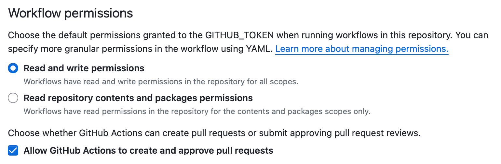

# `gha-utils` CLI + reusable workflows

[](https://pypi.python.org/pypi/gha-utils)
[](https://pypi.python.org/pypi/gha-utils)
[](http://mypy-lang.org/)
[](https://github.com/kdeldycke/workflows/actions/workflows/tests.yaml?query=branch%3Amain)
[](https://app.codecov.io/gh/kdeldycke/workflows)

Thanks to this project, I am able to **release Python packages multiple times a day with only 2-clicks**.

This repository contains a collection of reusable workflows and its companion CLI called `gha-utils` (which stands for *GitHub action workflows utilities*).

It is designed for `uv`-based Python projects (and Awesome List projects as a bonus).

It takes care of:

- Version bumping
- Formatting autofix for: Python, Markdown, JSON, typos
- Linting: Python types with `mypy`, YAML, `zsh`, GitHub actions, links, Awesome lists, secrets
- Compiling of Python binaries for Linux / macOS / Windows on `x86_64`	& `arm64`
- Building of Python packages and upload to PyPi
- Git version tagging and GitHub release creation
- Synchronization of: `uv.lock`, `.gitignore`, `.mailmap` and Mermaid dependency graph
- Auto-locking of inactive closed issues
- Static image optimization
- Sphinx documentation building & deployment, and `autodoc` updates
- Label management, with file-based and content-based rules

Nothing is done behind your back. A PR is created everytime a change is proposed, so you can inspect it, ala dependabot.

## `gha-utils` CLI

### Executables

Standalone executables of `gha-utils`'s latest version are available as direct downloads for several platforms and architectures:

| Platform    | `x86_64`                                                                                                                          | `arm64`                                                                                                                           |
| ----------- | --------------------------------------------------------------------------------------------------------------------------------- | --------------------------------------------------------------------------------------------------------------------------------- |
| **Linux**   | [Download `gha-utils-linux-x64.bin`](https://github.com/kdeldycke/workflows/releases/latest/download/gha-utils-linux-x64.bin)     |                                                                                                                                   |
| **macOS**   | [Download `gha-utils-macos-x64.bin`](https://github.com/kdeldycke/workflows/releases/latest/download/gha-utils-macos-x64.bin)     | [Download `gha-utils-macos-arm64.bin`](https://github.com/kdeldycke/workflows/releases/latest/download/gha-utils-macos-arm64.bin) |
| **Windows** | [Download `gha-utils-windows-x64.exe`](https://github.com/kdeldycke/workflows/releases/latest/download/gha-utils-windows-x64.exe) |                                                                                                                                   |

### Run dev version

```shell-session
$ git clone https://github.com/kdeldycke/workflows
$ cd workflows
$ python -m pip install uv
$ uv venv
$ source .venv/bin/activate
$ uv pip install .
$ uv run -- gha-utils
```

## Reusable workflows collection

This repository contains workflows to automate most of the boring tasks.

These workflows are mostly used for Python projects and their documentation, but not only. They're all [reusable GitHub actions workflows](https://docs.github.com/en/actions/learn-github-actions/reusing-workflows).

Reasons for a centralized workflow repository:

- reusability of course: no need to update dozens of repository where 95% of workflows are the same
- centralize all dependencies pertaining to automation: think of the point-release of an action that triggers dependabot upgrade to all your repositories depending on it

### Guidelines

I don't want to copy-n-past, keep in sync and maintain another `N`th CI/CD file at the root of my repositories.

So my policy is: move every repository-specific config in a `pyproject.toml` file, or hide the gory details in a reused workflow.

### `.github/workflows/docs.yaml` jobs

- Autofix typos

- Optimize images

- Keep `.mailmap` up to date

- Update dependency graph of Python projects

  - **Requires**:
    - Python package with a `pyproject.toml` file

- Build Sphinx-based documentation and publish it to GitHub Pages

  - **Requires**:
    - Python package with a `pyproject.toml` file
    - All Sphinx dependencies in a `docs` [extra dependency group](https://packaging.python.org/en/latest/guides/writing-pyproject-toml/#dependencies-and-requirements):
      ```toml
      [project.optional-dependencies]
      docs = [
          "furo == 2024.1.29",
          "myst-parser ~= 3.0.0",
          "sphinx >= 6",
          ...
      ]
      ```
    - Sphinx configuration file at `docs/conf.py`

- Sync awesome projects from `awesome-template` repository

### Why all these `requirements/*.txt` files?

Let's look for example at the `lint-yaml` job from [`.github/workflows/lint.yaml`](https://github.com/kdeldycke/workflows/blob/main/.github/workflows/lint.yaml#L126). Here we only need the `yamllint` CLI. This CLI is [distributed on PyPi](https://pypi.org/project/yamllint/). So before executing it, we could have simply run the following step:

```yaml
  - name: Install yamllint
    run: |
      pip install yamllint
```

Instead, we install it via the [`requirements/yamllint.txt` file](https://github.com/kdeldycke/workflows/blob/main/requirements/yamllint.txt).

Why? Because I want the version of `yamllint` to be pinned. By pinning it, I make the workflow stable, predictable and reproducible.

So why use a dedicated requirements file? Why don't we simply add the version? Like this:

```yaml
  - name: Install yamllint
    run: |
      pip install yamllint==1.35.1
```

That would indeed pin the version. But it requires the maintainer (me) to keep track of new release and update manually the version string. That's a lot of work. And I'm lazy. So this should be automated.

To automate that, the only practical way I found was to rely on dependabot. But dependabot cannot update arbitrary versions in `run:` YAML blocks. It [only supports `requirements.txt` and `pyproject.toml`](https://docs.github.com/en/code-security/dependabot/dependabot-version-updates/configuration-options-for-the-dependabot.yml-file#pip-and-pip-compile) files for Python projects.

So to keep track of new versions of dependencies while keeping them stable, we've hard-coded all Python libraries and CLIs in the `requirements/*.txt` files. All with pinned versions.

And for the case we need to install all dependencies in one go, we have a [`requirements.txt` file at the root](https://github.com/kdeldycke/workflows/blob/main/requirements.txt) that is referencing all files from the `requirements/` subfolder.

### Permissions and token

This repository updates itself via GitHub actions. It particularly updates its own YAML files in `.github/workflows`. That's forbidden by default. So we need extra permissions.

Usually, to grant special permissions to some jobs, you use the [`permissions` parameter in workflow](https://docs.github.com/en/actions/using-workflows/workflow-syntax-for-github-actions#permissions) files. It looks like this:

```yaml
on: (...)

jobs:

  my-job:
    runs-on: ubuntu-latest
    permissions:
      contents: write
      pull-requests: write

    steps: (...)
```

But the `contents: write` permission doesn't allow write access to the workflow files in the `.github` subfolder. There is `actions: write`, but it only covers workflow runs, not their YAML source file. Even a `permissions: write-all` doesn't work. So you cannot use the `permissions` parameter to allow a repository's workflow update its own workflow files.

You will always end up with this kind or errors:

```text
   ! [remote rejected] branch_xxx -> branch_xxx (refusing to allow a GitHub App to create or update workflow `.github/workflows/my_workflow.yaml` without `workflows` permission)

  error: failed to push some refs to 'https://github.com/kdeldycke/my-repo'
```

> [!NOTE]
> That's also why the Settings > Actions > General > Workflow permissions parameter on your repository has no effect on this issue, even with the `Read and write permissions` set:
> 

To bypass the limitation, we rely on a custom access token. By convention, we call it `WORKFLOW_UPDATE_GITHUB_PAT`. It will be used, [in place of the default `secrets.GITHUB_TOKEN`](https://github.com/search?q=repo%3Akdeldycke%2Fworkflows%20WORKFLOW_UPDATE_GITHUB_PAT&type=code), in steps in which we need to change the workflow YAML files.

To create this custom `WORKFLOW_UPDATE_GITHUB_PAT`:

- From your GitHub user, go to `Settings` > `Developer Settings` > `Personal Access Tokens` > `Fine-grained tokens`
- Click on the `Generate new token` button
- Choose a good token name like `workflow-self-update` to make your intention clear
- Choose `Only select repositories` and the list the repositories in needs of updating their workflow YAML files
- In the `Repository permissions` drop-down, sets:
  - `Contents`: `Access: **Read and Write**`
  - `Metadata` (mandatory): `Access: **Read-only**`
  - `Pull Requests`: `Access: **Read and Write**`
  - `Workflows`: `Access: **Read and Write**`
    > [!NOTE]
    > This is the only place where I can have control over the `Workflows` permission, which is not supported by the `permissions:` parameter in YAML files.
- Now save these parameters and copy the `github_pat_XXXX` secret token
- Got to your repo > `Settings` > `Security` > `Secrets and variables` > `Actions` > `Secrets` > `Repository secrets` and click `New repository secrets`
- Name your secret `WORKFLOW_UPDATE_GITHUB_PAT` and copy the `github_pat_XXXX` token in the `Secret` field

Now re-run your actions and they should be able to update the workflow files in `.github` folder without the `refusing to allow a GitHub App to create or update workflow` error.

### Release management

It turns out [Release Engineering is a full-time job, and full of edge-cases](https://blog.axo.dev/2023/02/cargo-dist).

Rust has [`cargo-dist`](https://github.com/axodotdev/cargo-dist). Go has... ? But there is no equivalent for Python.

So I made up a [`release.yaml` workflow](https://github.com/kdeldycke/workflows/blob/main/.github/workflows/release.yaml), which:

1. Extracts project metadata from `pyproject.toml`
1. Generates a build matrix of all commits / os / arch / CLI entry points
1. Build Python wheel with Twine
1. Compile binaries of all CLI with Nuitka
1. Tag the release commit in Git
1. Publish new version to PyPi
1. Publish a GitHub release
1. Attach and rename build artifacts to it

## Changelog

A [detailed changelog](changelog.md) is available.

## Used in

Check these projects to get real-life examples of usage and inspiration:

-  [Awesome Falsehood](https://github.com/kdeldycke/awesome-falsehood#readme) - Falsehoods Programmers Believe in.
-  [Awesome Engineering Team Management](https://github.com/kdeldycke/awesome-engineering-team-management#readme) - How to transition from software development to engineering management.
-  [Awesome IAM](https://github.com/kdeldycke/awesome-iam#readme) - Identity and Access Management knowledge for cloud platforms.
-  [Awesome Billing](https://github.com/kdeldycke/awesome-billing#readme) - Billing & Payments knowledge for cloud platforms.
-  [Meta Package Manager](https://github.com/kdeldycke/meta-package-manager#readme) - A unifying CLI for multiple package managers.
-  [Mail Deduplicate](https://github.com/kdeldycke/mail-deduplicate#readme) - A CLI to deduplicate similar emails.
-  [dotfiles](https://github.com/kdeldycke/dotfiles#readme) - macOS dotfiles for Python developers.
-  [Click Extra](https://github.com/kdeldycke/click-extra#readme) - Extra colorization and configuration loading for Click.
-  [Wiki bot](https://github.com/themagicalmammal/wikibot#readme) - A bot which provides features from Wikipedia like summary, title searches, location API etc.
-  [workflows](https://github.com/kdeldycke/workflows#readme) - Itself. Eat your own dog-food.
-  [Stock Analysis](https://github.com/themagicalmammal/stock-analyser#readme) - Simple to use interfaces for basic technical analysis of stocks.
-  [GeneticTabler](https://github.com/themagicalmammal/genetictabler#readme) - Time Table Scheduler using Genetic Algorithms.
-  [Excel Write](https://github.com/themagicalmammal/excel-write#readme) - Optimised way to write in excel files.

Feel free to send a PR to add your project in this list if you are relying on these scripts.

## Release process

All steps of the release process and version management are automated in the
[`changelog.yaml`](https://github.com/kdeldycke/workflows/blob/main/.github/workflows/changelog.yaml)
and
[`release.yaml`](https://github.com/kdeldycke/workflows/blob/main/.github/workflows/release.yaml)
workflows.

All there's left to do is to:

- [check the open draft `prepare-release` PR](https://github.com/kdeldycke/workflows/pulls?q=is%3Apr+is%3Aopen+head%3Aprepare-release)
  and its changes,
- click the `Ready for review` button,
- click the `Rebase and merge` button,
- let the workflows tag the release and set back the `main` branch into a
  development state.
