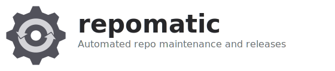

<p align="center">
  
</p>

[](https://pypi.org/project/repomatic/)
[](https://pypi.org/project/repomatic/)
[](https://pepy.tech/projects/repomatic)
[](https://github.com/kdeldycke/repomatic/actions/workflows/tests.yaml?query=branch%3Amain)
[](https://app.codecov.io/gh/kdeldycke/repomatic)

A Python CLI and `pyproject.toml` configuration that let you **release Python packages multiple times a day with only 2-clicks**. Designed for `uv`-based Python projects, but usable for other projects too. The CLI operates through reusable GitHub Actions workflows as its CI delivery mechanism.

**Maintainer-in-the-loop**: nothing is done behind your back. A PR or issue is created every time a change is proposed or action is needed.

## What it automates

- Version bumping, git tagging, and GitHub release creation
- Changelog management
- Python package building and PyPI publishing with supply chain attestations
- Cross-platform binary compilation (Linux / macOS / Windows, x86_64 / arm64)
- Formatting autofix for Python, Markdown, JSON, Shell, and typos
- Linting: Python types with mypy, YAML, GitHub Actions, workflow security, URLs, secrets, and Awesome lists
- Synchronization of `uv.lock`, `.gitignore`, `.mailmap`, and Mermaid dependency graph
- Label management with file-based and content-based rules
- Inactive issue locking
- Static image optimization
- Sphinx documentation building, deployment, and autodoc updates
- Awesome list template synchronization

## Why repomatic

- [18 third-party GitHub Actions replaced](https://kdeldycke.github.io/repomatic/security.html#third-party-action-minimization) by internal CLI commands and SHA-256-verified binary downloads, keeping the supply chain attack surface minimal
- [8 Python linters and formatters](https://kdeldycke.github.io/repomatic/security.html#ruff-consolidation) (pylint, black, isort, pyupgrade, pydocstyle, pycln, docformatter, blacken-docs) consolidated into ruff
- [5 packaging and install tools](https://kdeldycke.github.io/repomatic/security.html#uv-consolidation) (poetry, build, twine, check-wheel-contents, pip-audit) consolidated into uv
- All `uses:` references [pinned to full commit SHAs](https://kdeldycke.github.io/repomatic/security.html#supply-chain-security) via Renovate, with stabilization windows before adopting new versions
- [SLSA provenance attestations](https://kdeldycke.github.io/repomatic/security.html#supply-chain-security) on every release artifact (wheels and compiled binaries)
- [VirusTotal scanning](https://kdeldycke.github.io/repomatic/security.html#av-false-positive-submissions) of compiled binaries to seed AV vendor databases and reduce false positives
- [Trusted Publishing](https://kdeldycke.github.io/repomatic/workflows.html#github-workflows-release-yaml-jobs) for PyPI uploads: no long-lived tokens stored as secrets
- [Immutable releases](https://kdeldycke.github.io/repomatic/security.html#supply-chain-security) enforced via GitHub's tag protection and release locking
- Workflow security linting with [`zizmor`](https://kdeldycke.github.io/repomatic/workflows.html#github-workflows-lint-yaml-jobs) on every push to catch dangerous triggers and excessive permissions
- Credential scanning with [`gitleaks`](https://kdeldycke.github.io/repomatic/workflows.html#github-workflows-lint-yaml-jobs) to prevent secret leakage
- Single [`pyproject.toml` configuration](https://kdeldycke.github.io/repomatic/configuration.html): no extra dotfiles, no JSON configs, no YAML presets to maintain
- [15+ code quality tools](https://kdeldycke.github.io/repomatic/tool-runner.html) (ruff, mypy, biome, typos, mdformat, shfmt, yamllint, actionlint, lychee, oxipng, jpegoptim, pyproject-fmt, labelmaker, gitleaks, zizmor) managed through one `repomatic run <tool>` interface with automatic installation and platform-specific binary caching

## Quick start

```shell-session
$ cd my-project
$ uvx -- repomatic init
$ git add .
$ git commit -m "Add repomatic"
$ git push
```

Works for new and existing repositories. Managed files are always regenerated to the latest version; `changelog.md` is never overwritten. Push, and the workflows guide you through remaining setup via issues and PRs.

See `repomatic init --help` for available components and options.

## Documentation

See the **[full documentation](https://kdeldycke.github.io/repomatic/)** for:

- [Installation methods and executables](https://kdeldycke.github.io/repomatic/install.html)
- [`[tool.repomatic]` configuration reference](https://kdeldycke.github.io/repomatic/configuration.html)
- [CLI parameters](https://kdeldycke.github.io/repomatic/cli.html)
- [Reusable workflow reference](https://kdeldycke.github.io/repomatic/workflows.html) (all 13 workflows with job descriptions)
- [Security practices and token setup](https://kdeldycke.github.io/repomatic/security.html)
- [Claude Code skills](https://kdeldycke.github.io/repomatic/skills.html)
- [API reference](https://kdeldycke.github.io/repomatic/repomatic.html)

## Used in

Check these projects to get real-life examples of usage and inspiration:

-  [Awesome Falsehood](https://github.com/kdeldycke/awesome-falsehood) - Falsehoods Programmers Believe in.
-  [Awesome Engineering Team Management](https://github.com/kdeldycke/awesome-engineering-team-management) - How to transition from software development to engineering management.
-  [Awesome IAM](https://github.com/kdeldycke/awesome-iam) - Identity and Access Management knowledge for cloud platforms.
-  [Awesome Billing](https://github.com/kdeldycke/awesome-billing) - Billing & Payments knowledge for cloud platforms.
-  [Meta Package Manager](https://github.com/kdeldycke/meta-package-manager) - A unifying CLI for multiple package managers.
-  [Mail Deduplicate](https://github.com/kdeldycke/mail-deduplicate) - A CLI to deduplicate similar emails.
-  [dotfiles](https://github.com/kdeldycke/dotfiles) - macOS dotfiles for Python developers.
-  [Click Extra](https://github.com/kdeldycke/click-extra) - Extra colorization and configuration loading for Click.
-  [repomatic](https://github.com/kdeldycke/repomatic) - Itself. Eat your own dog-food.
-  [Extra Platforms](https://github.com/kdeldycke/extra-platforms) - Detect platforms and group them by family.

Send a PR to add your project if you use repomatic.

## Development

See `claude.md` for development commands, code style, testing guidelines, and design principles.
